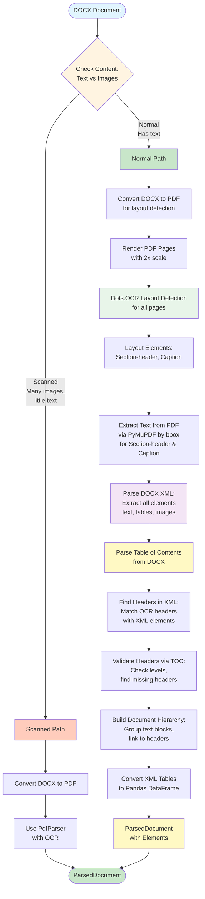
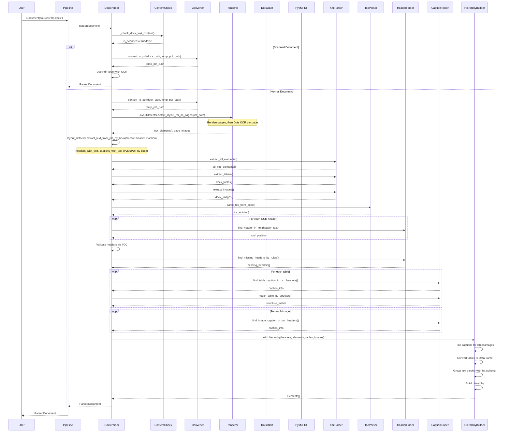

# DOCX Parser Documentation

Complete documentation for the DOCX parser implementation.

## Overview

The DOCX parser uses a **combined approach** (see `documentor/processing/parsers/docx/docx_parser.py`):

1. **DOTS OCR** for detecting structural elements (headers, captions)
2. **PyMuPDF** for extracting text from PDF by bbox (faster and more accurate for text PDFs)
3. **XML parsing** for extracting full content (text, tables, images)
4. **Table of Contents (TOC) parsing** for validation and improving results
5. **Building complete document hierarchy**
6. **Automatic detection of scanned documents** and processing via PdfParser with OCR

## Architecture



## Processing Pipeline

### Step 1: Content Check (Scanned Document Detection)

**Method**: `_check_docx_text_content(docx_path: Path, ...) -> Dict[str, Any]`

**Process**:
1. Parse DOCX XML to extract all elements
2. Count:
   - Total text length
   - Number of text paragraphs
   - Number of images
3. Determine if scanned:
   - Documents with tables are never considered scanned (tables contain structured text).
   - Otherwise: no text (length < min_text_length) OR (images > 0 AND text < min_text_for_non_scanned AND images > text_paragraphs * ratio)

**Configuration**:
```yaml
docx_parser:
  scanned_detection:
    min_text_length: 100
    min_text_for_non_scanned: 500
    images_to_text_ratio: 2.0
```

**Result**: Dictionary with `is_scanned` flag and content statistics.

**If Scanned**: Convert to PDF and process via `PdfParser` with OCR (see PDF parser documentation).

### Step 2: DOCX to PDF Conversion

**Method**: `DocxConverter.convert_to_pdf(docx_path: Path, pdf_path: Path)` (used as `self.converter.convert_to_pdf()`)

**Process**:
1. Try conversion methods in order:
   - **win32com** (Windows only): Uses Microsoft Word COM interface
   - **docx2pdf**: Python library for conversion
   - **LibreOffice**: Command-line conversion
2. Create temporary PDF file for layout detection

**Result**: PDF file ready for layout detection.

### Step 3: Layout Detection

**Method**: `DocxLayoutDetector.detect_layout_for_all_pages(pdf_path: Path) -> Tuple[List[Dict], Dict]`

**Process**:
1. **Page Rendering**: Render all PDF pages as images (scale from config: `layout_detection.render_scale`, default 2.0)
   - Uses `PdfPageRenderer` from `documentor.processing.parsers.pdf.ocr.page_renderer`
2. **Layout Detection**: For each page, call Dots OCR layout detector (`DotsOCRLayoutDetector.detect_layout()`)
   - Gets layout elements with categories and bbox coordinates
3. **Filter Elements**: Only `Section-header` and `Caption` are used for text extraction; other elements (Text, Table, Picture) are taken from XML

**Result**: List of layout elements and page images dict:
```python
[
    {
        "category": "Section-header",
        "bbox": [x1, y1, x2, y2],
        "page_num": 0
    },
    {
        "category": "Caption",
        "bbox": [x1, y1, x2, y2],
        "page_num": 1
    },
    ...
]
```

### Step 4: Text Extraction from PDF

**Method**: `DocxLayoutDetector.extract_text_from_pdf_by_bbox(elements: List[Dict], pdf_doc: fitz.Document, render_scale: float) -> List[Dict]` (called via `self.layout_detector.extract_text_from_pdf_by_bbox()`)

**Process**:
1. For each Section-header and Caption element:
   - Get bbox coordinates from layout detection
   - Convert coordinates from image scale to PDF scale (divide by render_scale)
   - Extract text using PyMuPDF: `page.get_textbox(rect)`
   - Fallback: `page.get_text("dict", clip=rect)` if get_textbox fails
2. Store extracted text with element metadata

**Result**: Elements with extracted text:
```python
[
    {
        "category": "Section-header",
        "bbox": [...],
        "page_num": 0,
        "text": "1. Introduction"
    },
    ...
]
```

### Step 5: XML Parsing

**Method**: `DocxXmlParser.extract_all_elements()`, `extract_tables()`, `extract_images()`

**Process**:
1. **Extract All Elements**:
   - Parse `word/document.xml` from DOCX (ZIP archive)
   - Extract paragraphs and tables in order
   - Store XML position for each element
2. **Extract Tables**:
   - Parse table XML structure
   - Extract cell content
   - Store raw table data
3. **Extract Images**:
   - Parse image relationships
   - Extract image paths and metadata
   - Store image information

**Result**: 
- `all_xml_elements`: List of all XML elements with text and position
- `docx_tables`: List of tables with raw cell data
- `docx_images`: List of images with paths and metadata

### Step 6: Table of Contents Parsing

**Method**: `parse_toc_from_docx(docx_path: Path, all_xml_elements: List[Dict]) -> List[Dict]`

**Process**:
1. **Try TOC Field**: Look for `{TOC}` field in XML (dynamic TOC)
2. **Try TOC Styles**: Look for paragraphs with TOC1, TOC2, TOC3 styles
3. **Try Static Text**: Find "Contents" or "Table of contents" header (Russian Содержание/Оглавление also matched), then parse following paragraphs:
   - Look for numbered entries (1., 1.1., etc.)
   - Extract title and page number
   - Determine level from numbering depth
4. **Parse Hyperlinks**: Extract TOC entries from hyperlinks

**Result**: List of TOC entries:
```python
[
    {
        "title": "1. Introduction",
        "level": 1,
        "page": 3
    },
    {
        "title": "1.1 Background",
        "level": 2,
        "page": 3
    },
    ...
]
```

### Step 7: Header Finding and Matching

**Method**: `DocxHeaderProcessor.process_headers()`, `find_header_in_xml()`, `find_missing_headers_by_rules()`

**Process**:
1. **Match OCR Headers with XML**:
   - For each Section-header from OCR:
     - Search for matching text in XML elements
     - Start from last found position (for efficiency)
     - Find XML position of header
2. **Extract Paragraph Properties**:
   - Check if paragraph has heading style (Heading 1-6)
   - Get style level if available
   - Check for list item, definition pattern, separator line
   - Extract font properties (size, bold, italic, alignment, Caps Lock)
3. **Filter False Positives**:
   - Skip list items (unless numbered header with capital letter)
   - Skip definition patterns (unless heading style)
   - Skip separator lines (unless heading style)
   - Skip list item patterns (unless heading style)
   - Skip document metadata (title page, author, etc.)
   - Skip list headers (e.g. "List includes", etc.)
4. **Find Missing Headers by Rules**:
   - Build header rules from found headers (font size, bold, style, alignment, etc.)
   - Search XML for paragraphs matching these rules
   - Use adaptive thresholds based on found headers
   - Check numbering sequences to avoid false positives from lists
   - Filter out chains of 3+ consecutive headers of same level (likely lists)

**Result**: List of header positions:
```python
[
    {
        "ocr_header": {...},  # Header from OCR (optional)
        "xml_position": 42,   # Position in XML
        "text": "1. Introduction",
        "is_numbered_header": True,
        "level": 1,
        "from_toc": False,
        "found_by_rules": False  # True if found via find_missing_headers_by_rules
    },
    ...
]
```

### Step 8: TOC Validation

**Method**: Validates headers using TOC entries

**Process**:
1. **Create TOC Map**: Map normalized titles to TOC info (level, page)
2. **Validate Found Headers**:
   - Check if header text matches TOC entry
   - Use TOC level if available
   - Mark headers found via TOC
3. **Find Missing Headers**:
   - For each TOC entry not found in headers:
     - Search for header text in XML
     - If found, add to header positions
     - Mark as found by TOC

**Result**: Updated header positions with TOC validation.

### Step 9: Caption Finding and Table Matching

**Method**: `find_table_caption_in_ocr_headers()`, `find_image_caption_in_ocr_headers()`, `match_table_by_structure()`, `match_table_with_caption()`

**Process**:
1. **Find Table Captions**:
   - Search OCR headers and captions near table position
   - Look for patterns like "Table 1", "Таблица 1"
   - Extract table number from caption
   - Match with table by bbox proximity
2. **Find Image Captions**:
   - Search OCR headers and captions near image position
   - Look for patterns like "Figure 1", "Рисунок 1"
   - Extract image number from caption
   - Match with image by bbox proximity
3. **Match Tables by Structure**:
   - Extract top row/headers from XML table
   - Extract top row/headers from OCR table (from HTML or text extraction)
   - Compare structures using similarity matching
   - If structures match, use XML table (original) but enrich with OCR caption
4. **Enrich Tables and Images**:
   - Add `caption` and `table_number`/`image_number` to metadata if found
   - Preserve original XML structure (tables/images from XML are source of truth)

**Result**: Tables and images enriched with caption information from OCR.

### Step 10: Hierarchy Building

**Method**: `build_hierarchy(header_positions: List[Dict], all_xml_elements: List[Dict], docx_tables: List[Dict], docx_images: List[Dict], ...) -> List[Element]`

**Process**:
1. **Sort Headers**: Sort by XML position
2. **Group Text Blocks**:
   - For each header, collect all elements until next header
   - Group text paragraphs into blocks (max size: 3000 chars, max paragraphs: 10)
   - **Handle Numbered Lists**: Automatically split numbered list items (1., 2., 3.) into `LIST_ITEM` elements
   - Create TEXT elements for each block
3. **Process Tables**:
   - Match tables with OCR captions (from Step 9)
   - Convert XML table data to pandas DataFrame
   - Detect headers in first row
   - Normalize column counts
   - Create TABLE elements with DataFrame in metadata
   - Add `caption` and `table_number` to metadata if found
4. **Process Images**:
   - Match images with OCR captions (from Step 9)
   - Create IMAGE elements with image paths in metadata
   - Add `caption` and `image_number` to metadata if found
   - Link images to nearest header
5. **Build Hierarchy**:
   - Assign `parent_id` to each element based on nearest header
   - Handle nested headers (HEADER_2 under HEADER_1, etc.)
   - Determine header levels using priority:
     - Structural keywords (Chapter, Part; Russian equivalents supported) → level 1
     - Numbered patterns (1., 1.1., 1.1.1.) → levels 1, 2, 3
     - XML style properties (Heading 1-6)
     - TOC validation
     - Context (header stack)

**Configuration**:
```yaml
docx_parser:
  hierarchy:
    max_text_block_size: 3000
    max_paragraphs_per_block: 10
```

**Result**: List of `Element` objects with complete hierarchy and enriched metadata.

### Step 11: Table Conversion

**Method**: `_table_data_to_dataframe(table_data: Dict[str, Any]) -> pd.DataFrame`

**Process**:
1. **Detect Headers**: Check if first row contains headers (non-numeric, descriptive text)
2. **Normalize Columns**: Ensure all rows have same column count
3. **Create DataFrame**: Convert to pandas DataFrame
4. **Store in Metadata**: Store DataFrame in `metadata["dataframe"]`

**Result**: Table elements with DataFrame in metadata.

## Sequence Diagram



## Configuration

All configuration is in `documentor/config/config.yaml`:

```yaml
docx_parser:
  # Layout Detection
  layout_detection:
    render_scale: 2.0  # Scale for rendering PDF pages
  
  # Scanned Document Detection
  scanned_detection:
    min_text_length: 100
    min_text_for_non_scanned: 500
    images_to_text_ratio: 2.0
  
  # Hierarchy Building
  hierarchy:
    max_text_block_size: 3000
    max_paragraphs_per_block: 10
  
  # Document Processing
  processing:
    skip_title_page: false  # Skip first page if title page exists
```

## Key Methods

### `parse(document: Document) -> ParsedDocument`

Main entry point. Orchestrates the complete parsing pipeline.

### `_check_docx_text_content(docx_path: Path, ...) -> Dict[str, Any]`

Checks if document is scanned (image-based) or has text content.

### `DocxLayoutDetector.extract_text_from_pdf_by_bbox(elements, pdf_doc, render_scale) -> List[Dict]`

Extracts text from PDF by bbox coordinates for Section-header and Caption elements (called via `self.layout_detector.extract_text_from_pdf_by_bbox()`).

### `DocxXmlParser.extract_all_elements() -> List[Dict]`

Extracts all elements from DOCX XML in order of appearance.

### `DocxXmlParser.extract_tables() -> List[Dict]`

Extracts tables from DOCX XML with raw cell data.

### `DocxXmlParser.extract_images() -> List[Dict]`

Extracts images from DOCX XML with paths and metadata.

### `parse_toc_from_docx(docx_path: Path, all_xml_elements: List[Dict]) -> List[Dict]`

Parses table of contents from DOCX (static text, TOC styles, or hyperlinks).

### `find_header_in_xml(header_text: str, all_xml_elements: List[Dict], start_from: int) -> Optional[int]`

Finds header text in XML elements and returns XML position.

### `find_missing_headers_by_rules(docx_path: Path, all_xml_elements: List[Dict], header_rules: Dict, ...) -> List[Dict]`

Finds missing headers in XML using rules based on found headers. Uses adaptive thresholds and property matching.

### `find_table_caption_in_ocr_headers(ocr_headers: List[Dict], ocr_captions: List[Dict], table_bbox: List[float], ...) -> Optional[Dict]`

Finds table caption in OCR headers/captions by position and pattern matching.

### `find_image_caption_in_ocr_headers(ocr_headers: List[Dict], ocr_captions: List[Dict], image_bbox: List[float], ...) -> Optional[Dict]`

Finds image caption in OCR headers/captions by position and pattern matching.

### `match_table_by_structure(docx_table: Dict, ocr_tables: List[Dict], pdf_doc: Any, ...) -> Optional[Dict]`

Matches DOCX table with OCR table by comparing their structures (top row/headers).

### `build_hierarchy(header_positions: List[Dict], all_xml_elements: List[Dict], docx_tables: List[Dict], docx_images: List[Dict], ...) -> List[Element]`

Builds complete document hierarchy from all elements.

### `_table_data_to_dataframe(table_data: List[List[str]]) -> pd.DataFrame`

Converts XML table data to pandas DataFrame.

## Output Format

All parsers return unified `ParsedDocument`:

```python
ParsedDocument(
    source: str,
    format: DocumentFormat.DOCX,
    elements: List[Element],
    metadata: {
        "parser": "docx",
        "status": "completed",
        "processing_method": "layout_based",
        "total_pages": 45,
        "elements_count": 189,
        "headers_count": 12,
        "tables_count": 5,
        "images_count": 8,
    }
)
```

Each `Element` contains:
- `id`: Unique identifier
- `type`: ElementType (HEADER_1-6, TEXT, TABLE, IMAGE, etc.)
- `content`: Element content (text, table markdown, etc.)
- `parent_id`: Parent element ID (for hierarchy)
- `metadata`: Additional metadata (bbox, page_num, dataframe, image_path, etc.)

## Important Notes

1. **Combined approach**: Uses OCR (layout detection) + XML parsing + TOC validation for maximum accuracy.
2. **Dots.OCR is only for layout**: Text extraction uses PyMuPDF from PDF, not OCR LLM.
3. **TOC validation**: Table of contents is used to validate and find missing headers.
4. **Scanned document detection**: Automatically detects scanned DOCX and processes via PdfParser with OCR.
5. **Tables from XML**: Tables are extracted from XML and converted to DataFrame, not from OCR. However, captions are found via OCR and table structures are compared with OCR for validation.
6. **Images from XML**: Images are extracted from XML relationships, not from OCR. However, captions are found via OCR.
7. **Caption enrichment**: Table and image captions are found using OCR headers/captions and matched by position and pattern. The final table/image structure comes from XML (source of truth), but is enriched with OCR caption information.
8. **Missing header detection**: Headers missed by OCR are found using rules based on found headers (font properties, style, alignment, etc.) with adaptive thresholds.
9. **Numbered header support**: Supports numbered headers with or without spaces after numbers (e.g. "1Analysis", "1. Analysis", "1.1Relevance"; Cyrillic supported).
10. **List item handling**: Automatically identifies and splits numbered list items (1., 2., 3.) into `LIST_ITEM` elements, preventing false header detection.
