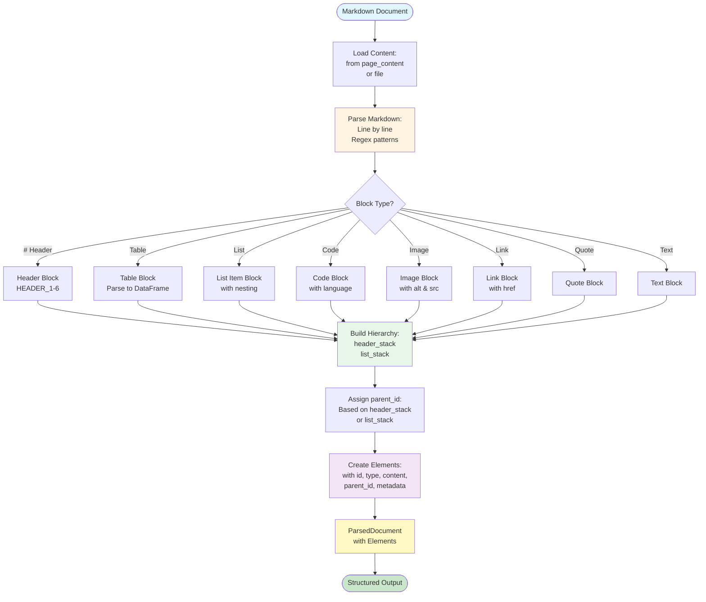
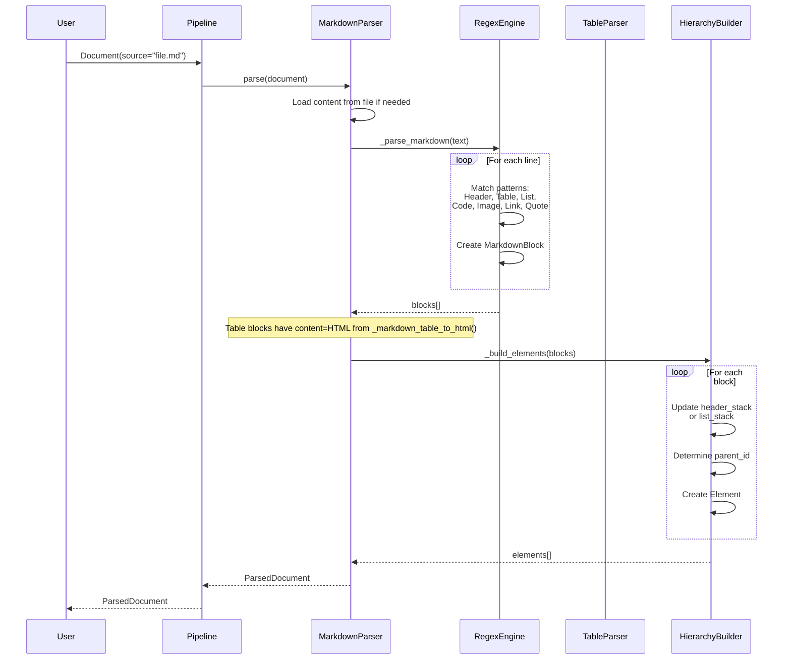

# Markdown Parser Documentation

Complete documentation for the Markdown parser implementation.

## Overview

The Markdown parser uses **regular expressions** for parsing Markdown syntax and converts the result into structured elements with hierarchy. It does not require LLM or OCR - it's a pure regex-based parser.

## Architecture



## Processing Pipeline

### Step 1: Content Loading

**Method**: `parse(document: Document) -> ParsedDocument`

**Process**:
1. Check if `document.page_content` has content
2. If empty, load from file specified in `metadata["source"]`
3. Read file content as UTF-8 text

**Result**: Markdown text string.

### Step 2: Markdown Parsing

**Method**: `_parse_markdown(text: str) -> List[MarkdownBlock]`

**Process**: Parse document line by line, detecting block types:

#### 2.1 Code Blocks (Highest Priority)

**Pattern**: ````language\n...\n````

**Process**:
- Find opening ```` with optional language
- Collect lines until closing ````
- Create `CODE_BLOCK` element with language in metadata

#### 2.2 Horizontal Lines

**Pattern**: `---`, `***`, `___` (3+ characters)

**Process**:
- Create `TEXT` element with `separator: true` in metadata

#### 2.3 Headers

**Pattern**: `^(#{1,6})\s+(.+)$`

**Process**:
- Extract header level (1-6) from `#` count
- Extract header text
- Create `HEADER_1-6` element with level in metadata

#### 2.4 Tables

**Pattern**: `^\s*\|.+\|\s*$`

**Process**:
1. **Collect Table Rows**:
   - Find first row with `|`
   - Skip delimiter row (`|---|`)
   - Collect all data rows
2. **Convert to HTML**:
   - Use `_markdown_table_to_html(table_lines, delimiter_line)` to build HTML table
   - Split rows by `|`, first row = headers, remaining = data
3. Create `MarkdownBlock` with `type=TABLE`, `content=table_html` (HTML string), `metadata={"source": "markdown"}`. DataFrame is not added in the pipeline; `_parse_table_to_dataframe()` exists for standalone use.

#### 2.5 Quotes

**Pattern**: `^(\>+\s+)(.+)`

**Process**:
- Extract quote content
- Collect multiline quotes (lines starting with `>`)
- Create `TEXT` element with `quote: true` in metadata

#### 2.6 Lists

**Pattern**: `^(\s*)([-*+]\s+|\d+\.\s+)(.+)$`

**Process**:
- Extract indentation (spaces)
- Extract list marker (`-`, `*`, `+`, or `1.`)
- Determine list type (ordered/unordered)
- Calculate nesting level (indent // 2)
- Create `LIST_ITEM` element with list metadata

#### 2.7 Images

**Pattern**: `!\[([^\]]*)\]\(([^)]+)\)`

**Process**:
- Extract alt text and URL
- Create `IMAGE` element with `alt` and `src` in metadata
- Remove images from line, process remaining text

#### 2.8 Links

**Pattern**: `\[([^\]]+)\]\(([^)]+)\)`

**Process**:
- Extract link text and URL
- If line is mostly links (>80%), create only link elements
- Otherwise, create link elements and process remaining text
- Create `LINK` element with `href` in metadata

#### 2.9 Regular Text

**Process**:
- Remove inline code markers (`` ` ``)
- Create `TEXT` element

**Result**: List of `MarkdownBlock` objects with type, content, and metadata.

### Step 3: Hierarchy Building

**Method**: `_build_elements(blocks: List[MarkdownBlock]) -> List[Element]`

**Process**:
1. **Sort Blocks**: Sort by line number to preserve order
2. **Maintain Stacks**:
   - `header_stack`: Stack of (level, element_id) for headers
   - `list_stack`: Stack of (level, element_id) for nested lists
3. **Process Each Block**:

   **For Headers**:
   - Remove headers from stack with level >= current
   - Parent is last header in stack (or None)
   - Add to header stack
   - Clear list stack (headers break list context)

   **For List Items**:
   - Remove list items from stack with level >= current
   - Parent priority:
     1. Last list item in stack (if inside list)
     2. Last header in stack (if not inside list)
   - Add to list stack

   **For Other Elements** (text, tables, code, images, links):
   - Parent priority:
     1. Last list item in stack (if inside list)
     2. Last header in stack (if not inside list)

4. **Create Elements**: Create `Element` objects with assigned `parent_id`

**Result**: List of `Element` objects with complete hierarchy.

## Sequence Diagram



## Supported Elements

### Headers (HEADER_1-6)

**Pattern**: `^(#{1,6})\s+(.+)$`

**Example**:
```markdown
# Header 1
## Header 2
### Header 3
```

**Element**:
```python
Element(
    type=ElementType.HEADER_1,
    content="Header 1",
    metadata={"source": "markdown", "level": 1}
)
```

### Lists (LIST_ITEM)

**Pattern**: `^(\s*)([-*+]\s+|\d+\.\s+)(.+)$`

**Example**:
```markdown
- Item 1
  - Nested item
    - Deep nested
1. Ordered item
```

**Element**:
```python
Element(
    type=ElementType.LIST_ITEM,
    content="Item 1",
    metadata={
        "source": "markdown",
        "list_type": "unordered",
        "list_level": 0,
        "indent": 0
    }
)
```

### Tables (TABLE)

**Pattern**: `^\s*\|.+\|\s*$`

**Example**:
```markdown
| Header 1 | Header 2 |
|----------|----------|
| Data 1   | Data 2   |
```

**Element**:
```python
Element(
    type=ElementType.TABLE,
    content="<table>...</table>",  # HTML from _markdown_table_to_html()
    metadata={"source": "markdown"}
)
```
Tables are stored with HTML in `content`. For a DataFrame, use `MarkdownParser._parse_table_to_dataframe(table_lines, delimiter_line)` separately.

### Code Blocks (CODE_BLOCK)

**Pattern**: ````language\n...\n````

**Example**:
````markdown
```python
def hello():
    print("Hello")
```
````

**Element**:
```python
Element(
    type=ElementType.CODE_BLOCK,
    content="def hello():\n    print(\"Hello\")",
    metadata={"source": "markdown", "language": "python"}
)
```

### Images (IMAGE)

**Pattern**: `!\[([^\]]*)\]\(([^)]+)\)`

**Example**:
```markdown

```

**Element**:
```python
Element(
    type=ElementType.IMAGE,
    content="Alt text",
    metadata={"source": "markdown", "alt": "Alt text", "src": "image.png"}
)
```

### Links (LINK)

**Pattern**: `\[([^\]]+)\]\(([^)]+)\)`

**Example**:
```markdown
[Link text](https://example.com)
```

**Element**:
```python
Element(
    type=ElementType.LINK,
    content="Link text",
    metadata={"source": "markdown", "href": "https://example.com"}
)
```

### Quotes (TEXT with quote metadata)

**Pattern**: `^(\>+\s+)(.+)`

**Example**:
```markdown
> This is a quote
> Multiline quote
```

**Element**:
```python
Element(
    type=ElementType.TEXT,
    content="This is a quote Multiline quote",
    metadata={"source": "markdown", "quote": True}
)
```

### Text (TEXT)

**Example**:
```markdown
This is regular text.
```

**Element**:
```python
Element(
    type=ElementType.TEXT,
    content="This is regular text.",
    metadata={"source": "markdown"}
)
```

## Hierarchy Building Logic

### Header Hierarchy

Headers form a hierarchy based on levels:
- HEADER_1 is parent of HEADER_2
- HEADER_2 is parent of HEADER_3
- When encountering a header, remove all headers with level >= current from stack
- All subsequent elements get `parent_id` from last header in stack

**Example**:
```markdown
# Header 1          → parent_id: None
Text under H1      → parent_id: header_1_id
## Header 2        → parent_id: header_1_id
Text under H2      → parent_id: header_2_id
### Header 3       → parent_id: header_2_id
Text under H3      → parent_id: header_3_id
## Header 2 again  → parent_id: header_1_id (H3 removed from stack)
```

### List Hierarchy

Lists form a hierarchy based on indentation:
- Each 2 spaces = 1 nesting level
- List items at same level share parent
- List items at deeper level have parent = last item at higher level
- If not inside list, parent = last header

**Example**:
```markdown
# Header 1
- Item 1           → parent_id: header_1_id
  - Nested 1       → parent_id: item_1_id
    - Deep nested  → parent_id: nested_1_id
  - Nested 2       → parent_id: item_1_id
- Item 2           → parent_id: header_1_id
```

### Mixed Hierarchy

When both headers and lists are present:
- Elements inside list: parent = last list item
- Elements outside list: parent = last header

**Example**:
```markdown
# Header 1
- List item        → parent_id: header_1_id
  Text in list     → parent_id: list_item_id
## Header 2       → parent_id: header_1_id
Text after list   → parent_id: header_2_id
```

## Table Parsing

**Method**: `_parse_table_to_dataframe(table_lines: List[str], delimiter_line: Optional[str]) -> pd.DataFrame`

Used for standalone table parsing; the main pipeline stores tables as HTML in `content` via `_markdown_table_to_html()`.

**Process**:
1. **Parse Rows**: Split each row by `|`, remove leading/trailing spaces
2. **Extract Headers**: First row = column headers
3. **Normalize Columns**: Ensure all rows have same column count (pad with empty strings)
4. **Create DataFrame**: Convert to pandas DataFrame with headers as column names

**Result**: DataFrame (not written to element metadata in the default pipeline).

## Configuration

No configuration needed - Markdown parser is fully automatic and regex-based.

## Key Methods

### `parse(document: Document) -> ParsedDocument`

Main entry point. Orchestrates the complete parsing pipeline.

### `_parse_markdown(text: str) -> List[MarkdownBlock]`

Parses Markdown text line by line and returns list of blocks.

### `_parse_table_to_dataframe(table_lines: List[str], delimiter_line: Optional[str]) -> pd.DataFrame`

Parses Markdown table to pandas DataFrame.

### `_build_elements(blocks: List[MarkdownBlock]) -> List[Element]`

Builds elements with hierarchy from blocks using header_stack and list_stack.

## Output Format

All parsers return unified `ParsedDocument`:

```python
ParsedDocument(
    source: str,
    format: DocumentFormat.MARKDOWN,
    elements: List[Element],
    metadata: {
        "parser": "markdown",
        "status": "completed",
        "source_type": "regex",
        "elements_count": 45,
        "headers_count": 8,
        "tables_count": 2,
        "images_count": 3,
    }
)
```

Each `Element` contains:
- `id`: Unique identifier
- `type`: ElementType (HEADER_1-6, TEXT, TABLE, IMAGE, LINK, LIST_ITEM, CODE_BLOCK)
- `content`: Element content (text, table markdown, code, etc.)
- `parent_id`: Parent element ID (for hierarchy)
- `metadata`: Additional metadata (source, level, dataframe, language, href, etc.)

## Important Notes

1. **No LLM or OCR**: Markdown parser is pure regex-based, no external services needed.
2. **Line-by-line parsing**: Document is parsed line by line, preserving order.
3. **Priority-based detection**: Code blocks have highest priority, then headers, then other elements.
4. **Table conversion**: All tables are automatically converted to pandas DataFrame.
5. **Nested lists**: Supports nested lists with proper hierarchy based on indentation.
6. **Header hierarchy**: Automatically builds header hierarchy based on levels (1-6).
