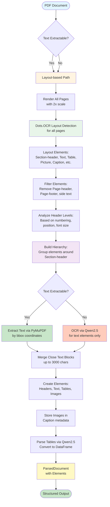
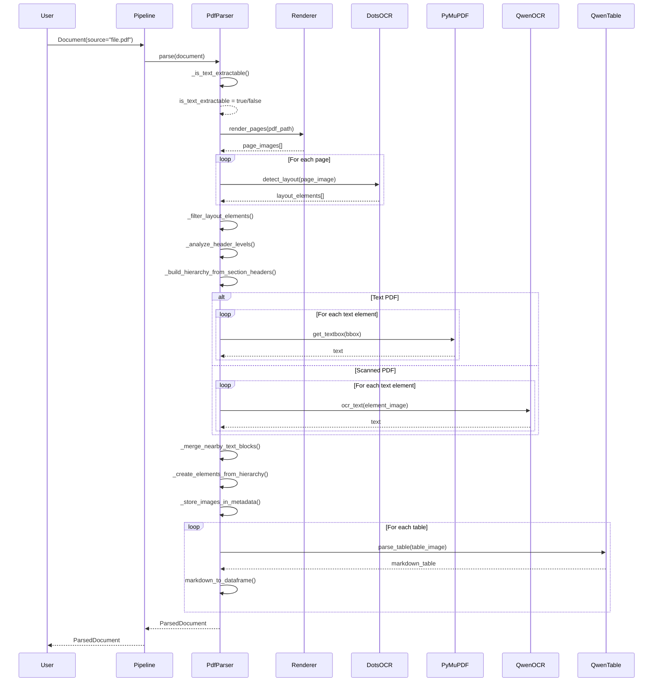

# PDF Parser Documentation

Complete documentation for the PDF parser implementation.

## Overview

The PDF parser uses a **layout-based approach** that always uses Dots.OCR for layout detection, regardless of whether text can be extracted from the PDF. This ensures consistent structure detection for all PDF types.

## Architecture



## Processing Pipeline

### Step 1: Text Extractability Check

**Method**: `_is_text_extractable(source: str) -> bool`

Checks if text can be extracted from the PDF by:
- Opening PDF with PyMuPDF
- Extracting text from first page
- Checking if text length >= 100 characters

**Result**: Boolean flag used later to determine text extraction method.

### Step 2: Layout Detection

**Method**: `_detect_layout_for_all_pages(source: str) -> List[Dict]`

**Process**:
1. **Page Rendering**: Render all PDF pages as images with 2x scale
   - Uses `PdfPageRenderer` with `render_scale=2.0`
   - Optimizes images for OCR if configured
2. **Layout Detection**: For each page, call Dots.OCR layout detection
   - Uses `PdfLayoutDetector` with direct API call (default)
   - Gets layout elements with categories and bbox coordinates
3. **Result**: List of layout elements with:
   ```python
   {
       "bbox": [x1, y1, x2, y2],
       "category": "Section-header",  # or "Text", "Table", "Picture", "Caption"
       "page_num": 0
   }
   ```

**Categories from Dots.OCR**:
- `Title` - Document title
- `Section-header` - Section header
- `Text` - Text block
- `Table` - Table
- `Picture` - Image
- `Caption` - Caption for image/table
- `Page-header` - Page header (filtered out)
- `Page-footer` - Page footer (filtered out)
- `Formula` - Formula
- `List-item` - List item
- `Footnote` - Footnote

### Step 3: Element Filtering

**Method**: `_filter_layout_elements(layout_elements: List[Dict]) -> List[Dict]`

**Filters**:
1. **Page Headers/Footers**: Removed if `remove_page_headers`/`remove_page_footers` is enabled
2. **Side Text**: Removed if outside main document area (x < 100 or x > 1400)
3. **Duplicate Elements**: Removed if bbox overlap > 80%

**Configuration**:
```yaml
pdf_parser:
  filtering:
    remove_page_headers: true
    remove_page_footers: true
```

### Step 4: Header Level Analysis

**Method**: `_analyze_header_levels_from_elements(elements: List[Dict], source: str) -> List[Dict]`

**Process**:
1. Extract text from Section-header elements using PyMuPDF
2. Analyze header properties:
   - **Numbering pattern**: `1.`, `1.1.`, `1.1.1.` → levels 1, 2, 3
   - **Font size**: Larger fonts → higher levels
   - **Position**: Left-aligned → higher levels
   - **Formatting**: Bold, uppercase → higher levels
3. Determine relative levels by comparing headers
4. Assign `level` (1-6) to each Section-header

**Result**: Elements with `level` field:
```python
{
    "category": "Section-header",
    "level": 1,  # HEADER_1
    "bbox": [...],
    "page_num": 0,
    "text": "1 INTRODUCTION"
}
```

### Step 5: Hierarchy Building

**Method**: `_build_hierarchy_from_section_headers(elements: List[Dict]) -> Dict`

**Process**:
1. Group elements by sections:
   - Find all Section-header elements
   - For each header, find all elements "under" it (by Y coordinate)
   - Group until next Section-header or end of page
2. Build tree structure:
   - Section-header → children elements
   - Determine parent_id based on header levels
3. Handle nested headers:
   - HEADER_2 under HEADER_1
   - HEADER_3 under HEADER_2, etc.

**Result**: Hierarchy dictionary:
```python
{
    "sections": [
        {
            "header": {
                "level": 1,
                "text": "1 INTRODUCTION",
                "bbox": [...],
                "page_num": 0
            },
            "children": [
                {"category": "Text", "bbox": [...], ...},
                {"category": "Table", "bbox": [...], ...},
                ...
            ]
        },
        ...
    ]
}
```

### Step 6: Text Extraction

**Method**: `_extract_text_by_bboxes(source: str, elements: List[Dict], use_ocr: bool) -> List[Dict]`

**For Text PDFs** (use_ocr=False):
1. For each Text element:
   - Get bbox coordinates from layout detection
   - Convert coordinates from image scale to PDF scale (divide by render_scale)
   - Extract text using PyMuPDF: `page.get_textbox(rect)`
   - Fallback: `page.get_text("dict", clip=rect)` if get_textbox fails
2. Result: Text elements with extracted content

**For Scanned PDFs** (use_ocr=True):
1. For each Text element:
   - Render element region as image (crop from page image)
   - Send to Qwen2.5 OCR API
   - Extract text from OCR response
2. **Note**: Picture elements are skipped (no OCR for images)
3. Result: Text elements with OCR-extracted content

**Result**: List of text elements:
```python
[
    {
        "category": "Text",
        "bbox": [...],
        "page_num": 0,
        "text": "Extracted text content...",
        "source": "ocr" or "pymupdf"
    },
    ...
]
```

### Step 7: Text Block Merging

**Method**: `_merge_nearby_text_blocks(text_elements: List[Dict], max_chunk_size: int = 3000) -> List[Dict]`

**Process**:
1. **Find Close Blocks**: 
   - Same page and close Y coordinate (difference < threshold)
   - Adjacent pages and close position
2. **Merge Blocks**:
   - Combine text content
   - Combine bbox (min x1,y1, max x2,y2)
   - Check total size < max_chunk_size
3. **Split Large Blocks**:
   - If size > max_chunk_size, split by sentences/paragraphs

**Result**: Merged text elements with combined content and bbox.

### Step 8: Element Creation

**Method**: `_create_elements_from_hierarchy(hierarchy: Dict, text_elements: List[Dict], layout_elements: List[Dict]) -> List[Element]`

**Process**:
1. **Create Header Elements**:
   - For each Section-header, create `Element` with type `HEADER_1-6`
   - Set `parent_id` based on header level hierarchy
   - Store metadata (bbox, page_num, level)
2. **Create Text Elements**:
   - For each text block, create `Element` with type `TEXT`
   - Set `parent_id` to nearest header
   - Store text content and metadata
3. **Create Table Elements**:
   - For each Table element, create `Element` with type `TABLE`
   - Store bbox and metadata (table will be parsed in Step 9)
   - Set `parent_id` to nearest header
4. **Create Image Elements**:
   - For each Picture element, create `Element` with type `IMAGE`
   - Store bbox and metadata (image will be stored in Step 9)
   - Set `parent_id` to nearest header
5. **Build Header Stack**:
   - Maintain stack of current headers
   - Update stack when encountering new header
   - All subsequent elements get `parent_id` from stack top

**Result**: List of `Element` objects with hierarchy.

### Step 9: Image Storage

**Method**: `_store_images_in_metadata(elements: List[Element], source: str) -> List[Element]`

**Process**:
1. For each IMAGE element:
   - Extract image from PDF using PyMuPDF by bbox
   - Convert to base64 or save to temporary file
   - Store in `metadata["image_data"]` or `metadata["image_path"]`
2. For Caption elements:
   - Find nearest Picture element
   - Store caption text in `metadata["caption"]`
   - Link Caption to Image via `parent_id`

**Result**: Elements with images stored in metadata.

### Step 10: Table Parsing

**Method**: `_parse_tables_with_qwen(elements: List[Element], source: str) -> List[Element]`

**Process**:
1. For each TABLE element:
   - Render table region from PDF as image
   - Send to Qwen2.5 with table parsing prompt
   - Get Markdown table from response
2. **Convert to DataFrame**:
   - Parse Markdown table to pandas DataFrame
   - Store DataFrame in `metadata["dataframe"]`
   - Store Markdown in `content`
3. **Detect Merged Tables**:
   - Analyze table structure (column count, headers)
   - Find "breaks" in structure
   - Split into multiple tables if needed

**Configuration**:
```yaml
pdf_parser:
  table_parsing:
    method: "markdown"
    qwen_model: "qwen2.5-7b-vl-instruct"
    detect_merged_tables: true
```

**Result**: Table elements with DataFrame in metadata.

## Sequence Diagram



## Configuration

All configuration is in `documentor/config/config.yaml`:

```yaml
pdf_parser:
  # Layout Detection
  layout_detection:
    render_scale: 2.0  # Scale for rendering pages
    optimize_for_ocr: true
    use_direct_api: true  # Use direct API call instead of manager
  
  # Element Filtering
  filtering:
    remove_page_headers: true
    remove_page_footers: true
  
  # Table Parsing
  table_parsing:
    method: "markdown"
    qwen_model: "qwen2.5-7b-vl-instruct"
    detect_merged_tables: true
  
  # Header Analysis
  header_analysis:
    use_font_size: true
    use_position: true
    min_font_size_diff: 2
  
  # Document Processing
  processing:
    skip_title_page: false  # Skip first page if title page exists
```

## Key Methods

### `parse(document: Document) -> ParsedDocument`

Main entry point. Orchestrates the complete parsing pipeline.

### `_is_text_extractable(source: str) -> bool`

Checks if text can be extracted from PDF.

### `_detect_layout_for_all_pages(source: str) -> List[Dict]`

Performs layout detection for all pages using Dots.OCR.

### `_filter_layout_elements(elements: List[Dict]) -> List[Dict]`

Filters out unnecessary elements (headers, footers, side text).

### `_analyze_header_levels_from_elements(elements: List[Dict], source: str) -> List[Dict]`

Determines header levels based on numbering, font size, position.

### `_build_hierarchy_from_section_headers(elements: List[Dict]) -> Dict`

Builds document hierarchy around Section-header elements.

### `_extract_text_by_bboxes(source: str, elements: List[Dict], use_ocr: bool) -> List[Dict]`

Extracts text using PyMuPDF (for text PDFs) or Qwen OCR (for scanned PDFs).

### `_merge_nearby_text_blocks(elements: List[Dict], max_chunk_size: int) -> List[Dict]`

Merges close text blocks up to max_chunk_size.

### `_create_elements_from_hierarchy(hierarchy: Dict, text_elements: List[Dict], layout_elements: List[Dict]) -> List[Element]`

Creates Element objects from hierarchy and text elements.

### `_store_images_in_metadata(elements: List[Element], source: str) -> List[Element]`

Stores images in Caption element metadata.

### `_parse_tables_with_qwen(elements: List[Element], source: str) -> List[Element]`

Parses tables using Qwen2.5 and converts to DataFrame.

## Output Format

All parsers return unified `ParsedDocument`:

```python
ParsedDocument(
    source: str,
    format: DocumentFormat.PDF,
    elements: List[Element],
    metadata: {
        "parser": "pdf",
        "status": "completed",
        "processing_method": "layout_based",
        "total_pages": 78,
        "elements_count": 245,
        "headers_count": 15,
        "tables_count": 8,
        "images_count": 12,
    }
)
```

Each `Element` contains:
- `id`: Unique identifier
- `type`: ElementType (HEADER_1-6, TEXT, TABLE, IMAGE, etc.)
- `content`: Element content (text, markdown table, etc.)
- `parent_id`: Parent element ID (for hierarchy)
- `metadata`: Additional metadata (bbox, page_num, dataframe, image_data, etc.)

## Important Notes

1. **Layout-based approach is always used**: Even if text can be extracted, layout detection is performed for structure.
2. **Dots.OCR is only for layout**: Text extraction uses PyMuPDF (for text PDFs) or Qwen OCR (for scanned PDFs).
3. **OCR is selective**: Only text elements are OCR'd for scanned PDFs, not Picture elements.
4. **Tables are parsed separately**: Tables are parsed via Qwen2.5 after initial structure is built.
5. **Images are stored in metadata**: Images are extracted and stored in Caption element metadata.
