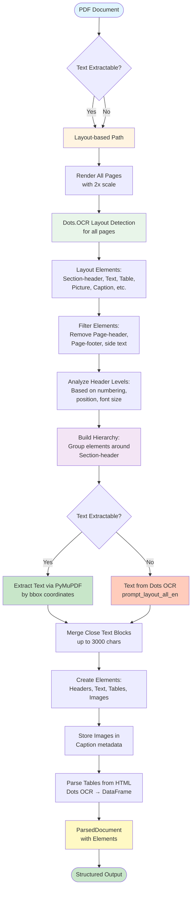
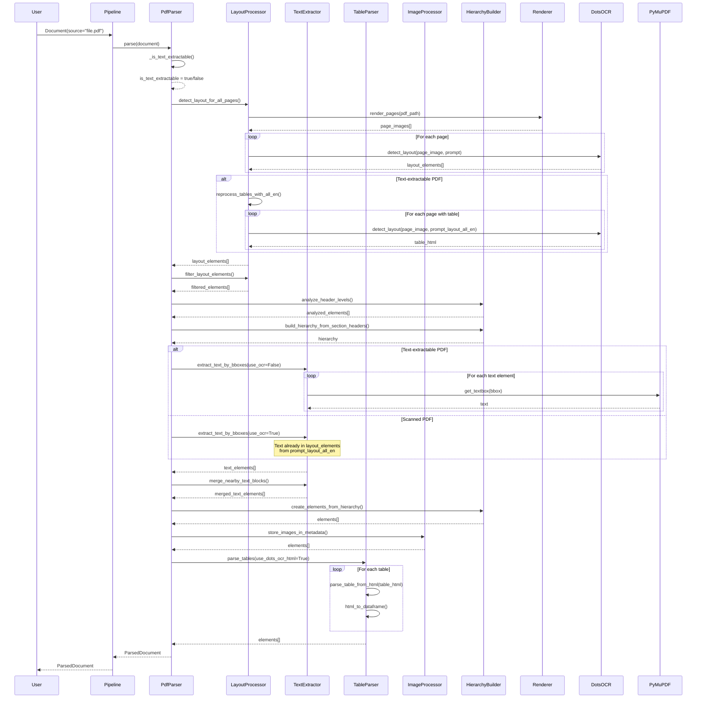

# PDF Parser Documentation

Complete documentation for the PDF parser implementation.

## Overview

The PDF parser uses a **layout-based approach** with specialized processors that always uses Dots.OCR for layout detection, regardless of whether text can be extracted from the PDF. This ensures consistent structure detection for all PDF types.

The parser uses different prompts based on PDF type:
- **Scanned PDFs**: Uses `prompt_layout_all_en` to extract layout, text, tables (HTML), and formulas (LaTeX) directly from Dots OCR
- **Text-extractable PDFs**: Uses `prompt_layout_only_en` for layout detection, then re-processes pages with tables using `prompt_layout_all_en` to get HTML, while extracting text via PyMuPDF

## Architecture



## Processing Pipeline

### Step 1: Text Extractability Check

**Method**: `_is_text_extractable(source: str) -> bool`

Checks if text can be extracted from the PDF by:
- Opening PDF with PyMuPDF
- Extracting text from first page
- Checking if text length >= 100 characters

**Result**: Boolean flag used later to determine text extraction method.

### Step 2: Layout Detection

**Method**: `PdfLayoutProcessor.detect_layout_for_all_pages(source: str, use_text_extraction: bool) -> List[Dict]`

**Process**:
1. **Page Rendering**: Render all PDF pages as images with 2x scale
   - Uses `PdfPageRenderer` with `render_scale=2.0`
   - Optimizes images for OCR if configured
2. **Layout Detection**: For each page, call Dots.OCR layout detection
   - **For scanned PDFs** (`use_text_extraction=True`):
     - Uses `prompt_layout_all_en` to get layout, text, tables (HTML), and formulas (LaTeX)
     - Elements contain `text` field with extracted text
     - Tables contain `table_html` or `html` field with HTML structure
   - **For text-extractable PDFs** (`use_text_extraction=False`):
     - Uses `prompt_layout_only_en` for layout detection only
     - Text will be extracted later via PyMuPDF
3. **Result**: List of layout elements with:
   ```python
   {
       "bbox": [x1, y1, x2, y2],
       "category": "Section-header",  # or "Text", "Table", "Picture", "Caption"
       "page_num": 0,
       "text": "...",  # Only for scanned PDFs (from prompt_layout_all_en)
       "table_html": "...",  # Only if table found (from prompt_layout_all_en)
       "html": "..."  # Alternative field name for table HTML
   }
   ```

**Categories from Dots.OCR**:
- `Title` - Document title
- `Section-header` - Section header
- `Text` - Text block
- `Table` - Table
- `Picture` - Image
- `Caption` - Caption for image/table
- `Page-header` - Page header (filtered out)
- `Page-footer` - Page footer (filtered out)
- `Formula` - Formula
- `List-item` - List item
- `Footnote` - Footnote

### Step 2.5: Table Reprocessing (Text-extractable PDFs only)

**Method**: `PdfLayoutProcessor.reprocess_tables_with_all_en(source: str, layout_elements: List[Dict]) -> List[Dict]`

**Process**:
1. **Identify Pages with Tables**: Find pages containing Table elements from initial layout detection
2. **Re-process with Full Prompt**: For each page with tables:
   - Re-render page image
   - Call Dots.OCR with `prompt_layout_all_en` to get HTML table structure
   - Update table elements with `table_html` or `html` field
3. **Result**: Updated layout elements with HTML table structure for tables

**Note**: This step is skipped for scanned PDFs (they already have HTML from `prompt_layout_all_en`).

### Step 3: Element Filtering

**Method**: `PdfLayoutProcessor.filter_layout_elements(layout_elements: List[Dict]) -> List[Dict]`

**Filters**:
1. **Page Headers/Footers**: Removed if `remove_page_headers`/`remove_page_footers` is enabled
2. **Side Text**: Removed if outside main document area (x < 100 or x > 1400)
3. **Duplicate Elements**: Removed if bbox overlap > 80%

**Configuration**:
```yaml
pdf_parser:
  filtering:
    remove_page_headers: true
    remove_page_footers: true
```

### Step 4: Header Level Analysis

**Method**: `PdfHierarchyBuilder.analyze_header_levels_from_elements(elements: List[Dict], source: str, is_text_extractable: bool) -> List[Dict]`

**Process**:
1. Extract text from Section-header elements using PyMuPDF
2. Analyze header properties:
   - **Numbering pattern**: `1.`, `1.1.`, `1.1.1.` → levels 1, 2, 3
   - **Font size**: Larger fonts → higher levels
   - **Position**: Left-aligned → higher levels
   - **Formatting**: Bold, uppercase → higher levels
3. Determine relative levels by comparing headers
4. Assign `level` (1-6) to each Section-header

**Result**: Elements with `level` field:
```python
{
    "category": "Section-header",
    "level": 1,  # HEADER_1
    "bbox": [...],
    "page_num": 0,
    "text": "1 INTRODUCTION"
}
```

### Step 5: Hierarchy Building

**Method**: `PdfHierarchyBuilder.build_hierarchy_from_section_headers(elements: List[Dict]) -> Dict`

**Process**:
1. Group elements by sections:
   - Find all Section-header elements
   - For each header, find all elements "under" it (by Y coordinate)
   - Group until next Section-header or end of page
2. Build tree structure:
   - Section-header → children elements
   - Determine parent_id based on header levels
3. Handle nested headers:
   - HEADER_2 under HEADER_1
   - HEADER_3 under HEADER_2, etc.

**Result**: Hierarchy dictionary:
```python
{
    "sections": [
        {
            "header": {
                "level": 1,
                "text": "1 INTRODUCTION",
                "bbox": [...],
                "page_num": 0
            },
            "children": [
                {"category": "Text", "bbox": [...], ...},
                {"category": "Table", "bbox": [...], ...},
                ...
            ]
        },
        ...
    ]
}
```

### Step 6: Text Extraction

**Method**: `PdfTextExtractor.extract_text_by_bboxes(source: str, layout_elements: List[Dict], use_ocr: bool) -> List[Dict]`

**For Text-extractable PDFs** (use_ocr=False):
1. For each Text element:
   - Get bbox coordinates from layout detection
   - Convert coordinates from image scale to PDF scale (divide by render_scale)
   - Extract text using PyMuPDF: `page.get_textbox(rect)`
   - Fallback: `page.get_text("dict", clip=rect)` if get_textbox fails
2. Result: Text elements with extracted content

**For Scanned PDFs** (use_ocr=True):
1. **Text already extracted**: Text is already in `text` field from Dots OCR (`prompt_layout_all_en`)
2. For each Text element:
   - Use `text` field from layout element (extracted by Dots OCR)
   - No additional OCR needed
3. Result: Text elements with Dots OCR-extracted content

**Result**: List of text elements:
```python
[
    {
        "category": "Text",
        "bbox": [...],
        "page_num": 0,
        "text": "Extracted text content...",
        "source": "ocr" or "pymupdf"
    },
    ...
]
```

### Step 7: Text Block Merging

**Method**: `PdfTextExtractor.merge_nearby_text_blocks(text_elements: List[Dict], max_chunk_size: int = 3000) -> List[Dict]`

**Process**:
1. **Find Close Blocks**: 
   - Same page and close Y coordinate (difference < threshold)
   - Adjacent pages and close position
2. **Merge Blocks**:
   - Combine text content
   - Combine bbox (min x1,y1, max x2,y2)
   - Check total size < max_chunk_size
3. **Split Large Blocks**:
   - If size > max_chunk_size, split by sentences/paragraphs

**Result**: Merged text elements with combined content and bbox.

### Step 8: Element Creation

**Method**: `PdfHierarchyBuilder.create_elements_from_hierarchy(hierarchy: Dict, merged_text_elements: List[Dict], layout_elements: List[Dict], source: str) -> List[Element]`

**Process**:
1. **Create Header Elements**:
   - For each Section-header, create `Element` with type `HEADER_1-6`
   - Set `parent_id` based on header level hierarchy
   - Store metadata (bbox, page_num, level)
2. **Create Text Elements**:
   - For each text block, create `Element` with type `TEXT`
   - Set `parent_id` to nearest header
   - Store text content and metadata
3. **Create Table Elements**:
   - For each Table element, create `Element` with type `TABLE`
   - Store bbox and metadata (table will be parsed in Step 9)
   - Set `parent_id` to nearest header
4. **Create Image Elements**:
   - For each Picture element, create `Element` with type `IMAGE`
   - Store bbox and metadata (image will be stored in Step 9)
   - Set `parent_id` to nearest header
5. **Build Header Stack**:
   - Maintain stack of current headers
   - Update stack when encountering new header
   - All subsequent elements get `parent_id` from stack top

**Result**: List of `Element` objects with hierarchy.

### Step 9: Image Storage

**Method**: `PdfImageProcessor.store_images_in_metadata(elements: List[Element], source: str) -> List[Element]`

**Process**:
1. For each IMAGE element:
   - Extract image from PDF using PyMuPDF by bbox
   - Convert to base64 or save to temporary file
   - Store in `metadata["image_data"]` or `metadata["image_path"]`
2. For Caption elements:
   - Find nearest Picture element
   - Store caption text in `metadata["caption"]`
   - Link Caption to Image via `parent_id`

**Result**: Elements with images stored in metadata.

### Step 10: Table Parsing

**Method**: `PdfTableParser.parse_tables(elements: List[Element], source: str, use_dots_ocr_html: bool = True) -> List[Element]`

**Process**:
1. For each TABLE element:
   - **HTML from Dots OCR**: Use `table_html` or `html` field from layout element (extracted by `prompt_layout_all_en`)
   - **Parse HTML**: Convert HTML table structure to pandas DataFrame
   - **Store Results**:
     - Store DataFrame in `metadata["dataframe"]`
     - Store Markdown representation in `content`
     - Store table image in `metadata["table_image"]` (base64)
2. **HTML Table Parsing**:
   - Uses `html_table_parser.parse_table_from_html()` to parse HTML
   - Handles merged cells, headers, and complex structures
   - Converts to normalized DataFrame format
3. **Fallback**: If HTML is not available, table is marked as failed

**Configuration**:
```yaml
pdf_parser:
  table_parsing:
    use_dots_ocr_html: true  # Use HTML from Dots OCR (prompt_layout_all_en)
```

**Result**: Table elements with DataFrame in metadata and Markdown in content.

**Note**: Tables are parsed from HTML provided by Dots OCR (`prompt_layout_all_en`). The HTML structure is already extracted during layout detection or table reprocessing.

## Sequence Diagram



## Configuration

All configuration is in `documentor/config/config.yaml`:

```yaml
pdf_parser:
  # Layout Detection
  layout_detection:
    render_scale: 2.0  # Scale for rendering pages
    optimize_for_ocr: true
    use_direct_api: true  # Use direct API call instead of manager
  
  # Element Filtering
  filtering:
    remove_page_headers: true
    remove_page_footers: true
  
  # Table Parsing
  table_parsing:
    method: "markdown"
    # Table parsing uses HTML from Dots OCR, no separate model needed
    detect_merged_tables: true
  
  # Header Analysis
  header_analysis:
    use_font_size: true
    use_position: true
    min_font_size_diff: 2
  
  # Document Processing
  processing:
    skip_title_page: false  # Skip first page if title page exists
```

## Architecture Components

The PDF parser uses specialized processors for different tasks:

### `PdfParser`
Main parser class that orchestrates the complete parsing pipeline.

### `PdfLayoutProcessor`
Handles layout detection and filtering:
- `detect_layout_for_all_pages()`: Performs layout detection using appropriate prompt
- `reprocess_tables_with_all_en()`: Re-processes pages with tables to get HTML
- `filter_layout_elements()`: Filters out unnecessary elements

### `PdfTextExtractor`
Handles text extraction:
- `extract_text_by_bboxes()`: Extracts text via PyMuPDF or uses Dots OCR text
- `merge_nearby_text_blocks()`: Merges close text blocks

### `PdfTableParser`
Handles table parsing:
- `parse_tables()`: Parses tables from Dots OCR HTML and converts to DataFrame

### `PdfImageProcessor`
Handles image processing:
- `store_images_in_metadata()`: Extracts and stores images in metadata

### `PdfHierarchyBuilder`
Handles hierarchy building:
- `analyze_header_levels_from_elements()`: Determines header levels
- `build_hierarchy_from_section_headers()`: Builds document hierarchy
- `create_elements_from_hierarchy()`: Creates Element objects

## Key Methods

### `PdfParser.parse(document: Document) -> ParsedDocument`

Main entry point. Orchestrates the complete parsing pipeline.

### `PdfParser._is_text_extractable(source: str) -> bool`

Checks if text can be extracted from PDF.

### `PdfLayoutProcessor.detect_layout_for_all_pages(source: str, use_text_extraction: bool) -> List[Dict]`

Performs layout detection for all pages using Dots.OCR with appropriate prompt.

### `PdfLayoutProcessor.reprocess_tables_with_all_en(source: str, layout_elements: List[Dict]) -> List[Dict]`

Re-processes pages with tables using `prompt_layout_all_en` to get HTML structure.

### `PdfLayoutProcessor.filter_layout_elements(elements: List[Dict]) -> List[Dict]`

Filters out unnecessary elements (headers, footers, side text).

### `PdfHierarchyBuilder.analyze_header_levels_from_elements(elements: List[Dict], source: str, is_text_extractable: bool) -> List[Dict]`

Determines header levels based on numbering, font size, position.

### `PdfHierarchyBuilder.build_hierarchy_from_section_headers(elements: List[Dict]) -> Dict`

Builds document hierarchy around Section-header elements.

### `PdfTextExtractor.extract_text_by_bboxes(source: str, layout_elements: List[Dict], use_ocr: bool) -> List[Dict]`

Extracts text using PyMuPDF (for text PDFs) or uses text from Dots OCR (for scanned PDFs).

### `PdfTextExtractor.merge_nearby_text_blocks(text_elements: List[Dict], max_chunk_size: int) -> List[Dict]`

Merges close text blocks up to max_chunk_size.

### `PdfHierarchyBuilder.create_elements_from_hierarchy(hierarchy: Dict, merged_text_elements: List[Dict], layout_elements: List[Dict], source: str) -> List[Element]`

Creates Element objects from hierarchy and text elements.

### `PdfImageProcessor.store_images_in_metadata(elements: List[Element], source: str) -> List[Element]`

Stores images in metadata (base64).

### `PdfTableParser.parse_tables(elements: List[Element], source: str, use_dots_ocr_html: bool) -> List[Element]`

Parses tables from Dots OCR HTML and converts to DataFrame.

## Output Format

All parsers return unified `ParsedDocument`:

```python
ParsedDocument(
    source: str,
    format: DocumentFormat.PDF,
    elements: List[Element],
    metadata: {
        "parser": "pdf",
        "status": "completed",
        "processing_method": "layout_based",
        "total_pages": 78,
        "elements_count": 245,
        "headers_count": 15,
        "tables_count": 8,
        "images_count": 12,
    }
)
```

Each `Element` contains:
- `id`: Unique identifier
- `type`: ElementType (HEADER_1-6, TEXT, TABLE, IMAGE, etc.)
- `content`: Element content (text, markdown table, etc.)
- `parent_id`: Parent element ID (for hierarchy)
- `metadata`: Additional metadata (bbox, page_num, dataframe, image_data, etc.)

## Important Notes

1. **Layout-based approach is always used**: Even if text can be extracted, layout detection is performed for structure.
2. **Different prompts for different PDF types**:
   - **Scanned PDFs**: Uses `prompt_layout_all_en` to extract layout, text, tables (HTML), and formulas (LaTeX) in one pass
   - **Text-extractable PDFs**: Uses `prompt_layout_only_en` for layout, then re-processes pages with tables using `prompt_layout_all_en` to get HTML
3. **Text extraction**:
   - **Text-extractable PDFs**: Text extracted via PyMuPDF by bbox coordinates
   - **Scanned PDFs**: Text already extracted by Dots OCR (`prompt_layout_all_en`) and stored in `text` field
4. **Tables are parsed from HTML**: Tables are parsed from HTML structure provided by Dots OCR (`prompt_layout_all_en`). HTML is obtained during layout detection (scanned PDFs) or table reprocessing (text-extractable PDFs).
5. **Images are stored in metadata**: Images are extracted and stored in metadata as base64.
6. **Specialized processors**: The parser uses separate processors for layout, text extraction, table parsing, image processing, and hierarchy building for better modularity and maintainability.
