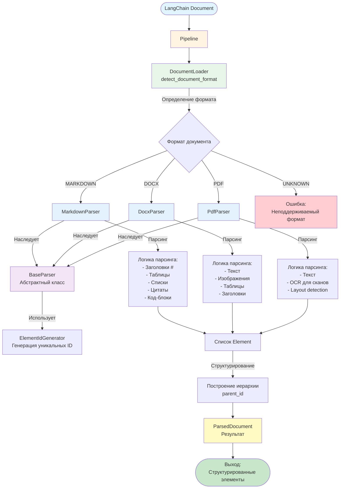
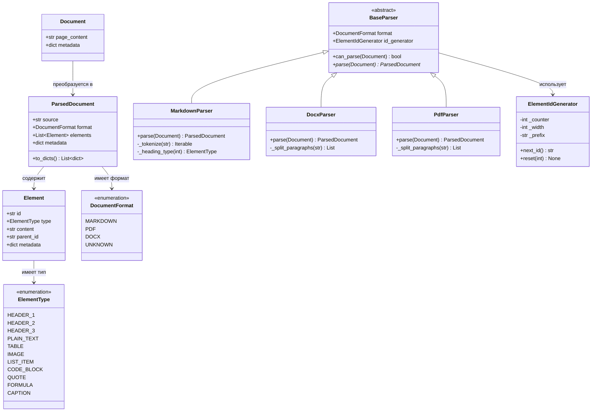
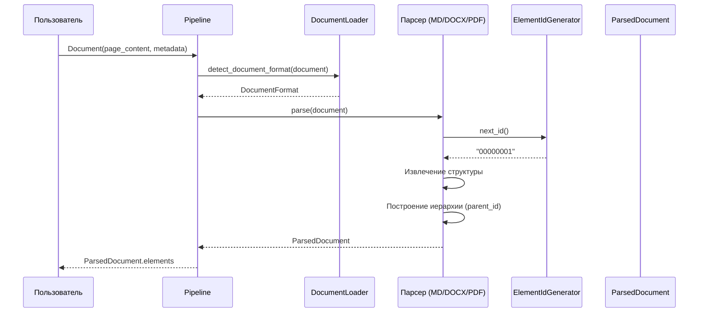

# Архитектура Documentor

## Блок-схема системы

```mermaid
graph TB
    Start([LangChain Document]) --> Pipeline[Pipeline]
    
    Pipeline --> Loader[DocumentLoader<br/>detect_document_format]
    
    Loader -->|Определение формата| FormatCheck{Формат документа}
    
    FormatCheck -->|MARKDOWN| MarkdownParser[MarkdownParser]
    FormatCheck -->|DOCX| DocxParser[DocxParser]
    FormatCheck -->|PDF| PdfParser[PdfParser]
    FormatCheck -->|UNKNOWN| Error[Ошибка:<br/>Неподдерживаемый формат]
    
    MarkdownParser -->|Наследует| BaseParser[BaseParser<br/>Абстрактный класс]
    DocxParser -->|Наследует| BaseParser
    PdfParser -->|Наследует| BaseParser
    
    BaseParser -->|Использует| IdGenerator[ElementIdGenerator<br/>Генерация уникальных ID]
    
    MarkdownParser -->|Парсинг| MarkdownLogic[Логика парсинга:<br/>- Заголовки #<br/>- Таблицы<br/>- Списки<br/>- Цитаты<br/>- Код-блоки]
    
    DocxParser -->|Парсинг| DocxLogic[Логика парсинга:<br/>- Текст<br/>- Изображения<br/>- Таблицы<br/>- Заголовки]
    
    PdfParser -->|Парсинг| PdfLogic[Логика парсинга:<br/>- Текст<br/>- OCR для сканов<br/>- Layout detection]
    
    MarkdownLogic --> Elements[Список Element]
    DocxLogic --> Elements
    PdfLogic --> Elements
    
    Elements -->|Структурирование| Hierarchy[Построение иерархии<br/>parent_id]
    
    Hierarchy --> ParsedDoc[ParsedDocument<br/>Результат]
    
    ParsedDoc --> Output([Выход:<br/>Структурированные элементы])
    
    style Start fill:#e1f5ff
    style Pipeline fill:#fff4e1
    style Loader fill:#e8f5e9
    style BaseParser fill:#f3e5f5
    style MarkdownParser fill:#e3f2fd
    style DocxParser fill:#e3f2fd
    style PdfParser fill:#e3f2fd
    style ParsedDoc fill:#fff9c4
    style Output fill:#c8e6c9
    style Error fill:#ffcdd2
```

## Детальная структура данных

```mermaid
classDiagram
    class Document {
        +str page_content
        +dict metadata
    }
    
    class ParsedDocument {
        +str source
        +DocumentFormat format
        +List~Element~ elements
        +dict metadata
        +to_dicts() List~dict~
    }
    
    class Element {
        +str id
        +ElementType type
        +str content
        +str parent_id
        +dict metadata
    }
    
    class ElementType {
        <<enumeration>>
        HEADER_1
        HEADER_2
        HEADER_3
        PLAIN_TEXT
        TABLE
        IMAGE
        LIST_ITEM
        CODE_BLOCK
        QUOTE
        FORMULA
        CAPTION
    }
    
    class DocumentFormat {
        <<enumeration>>
        MARKDOWN
        PDF
        DOCX
        UNKNOWN
    }
    
    class BaseParser {
        <<abstract>>
        +DocumentFormat format
        +ElementIdGenerator id_generator
        +can_parse(Document) bool
        +parse(Document)* ParsedDocument
    }
    
    class MarkdownParser {
        +parse(Document) ParsedDocument
        -_tokenize(str) Iterable
        -_heading_type(int) ElementType
    }
    
    class DocxParser {
        +parse(Document) ParsedDocument
        -_split_paragraphs(str) List
    }
    
    class PdfParser {
        +parse(Document) ParsedDocument
        -_split_paragraphs(str) List
    }
    
    class ElementIdGenerator {
        -int _counter
        -int _width
        -str _prefix
        +next_id() str
        +reset(int) None
    }
    
    Document --> ParsedDocument : преобразуется в
    ParsedDocument --> Element : содержит
    Element --> ElementType : имеет тип
    ParsedDocument --> DocumentFormat : имеет формат
    BaseParser <|-- MarkdownParser
    BaseParser <|-- DocxParser
    BaseParser <|-- PdfParser
    BaseParser --> ElementIdGenerator : использует
```

## Поток обработки документа

```mermaid
sequenceDiagram
    participant User as Пользователь
    participant Pipeline as Pipeline
    participant Loader as DocumentLoader
    participant Parser as Парсер (MD/DOCX/PDF)
    participant IdGen as ElementIdGenerator
    participant Result as ParsedDocument
    
    User->>Pipeline: Document(page_content, metadata)
    Pipeline->>Loader: detect_document_format(document)
    Loader-->>Pipeline: DocumentFormat
    
    Pipeline->>Parser: parse(document)
    Parser->>IdGen: next_id()
    IdGen-->>Parser: "00000001"
    
    Parser->>Parser: Извлечение структуры
    Parser->>Parser: Построение иерархии (parent_id)
    
    Parser-->>Pipeline: ParsedDocument
    Pipeline-->>User: ParsedDocument.elements
```
