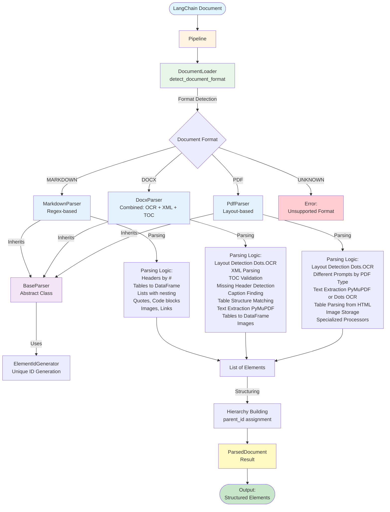
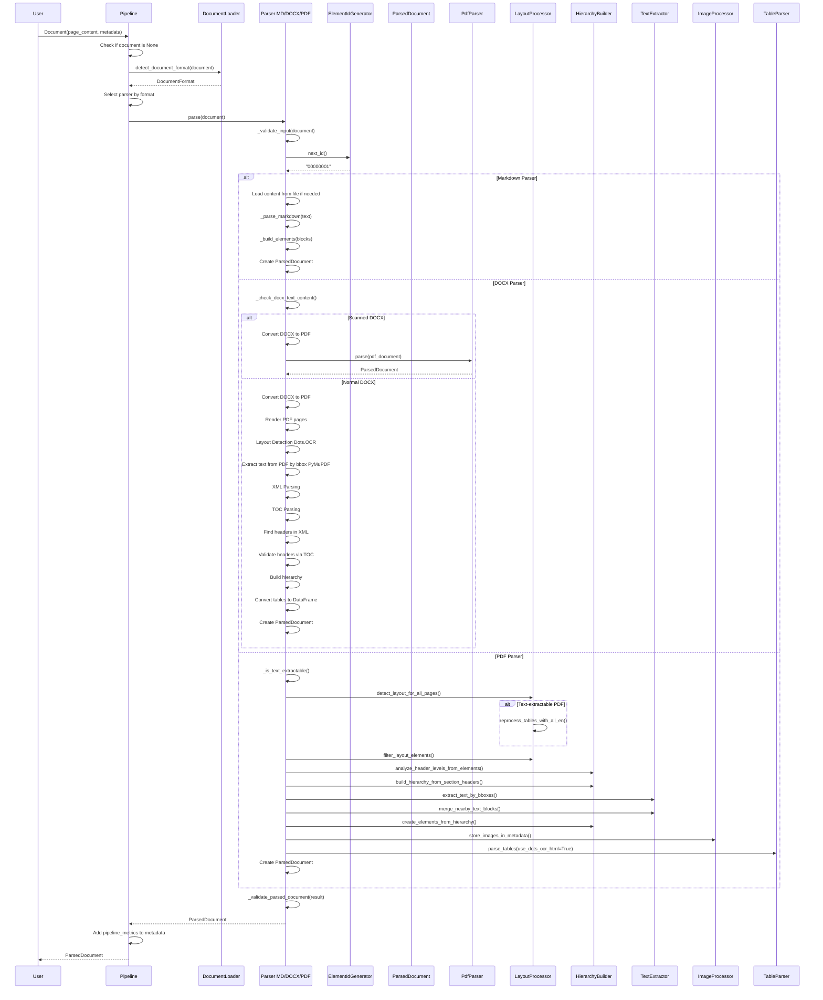
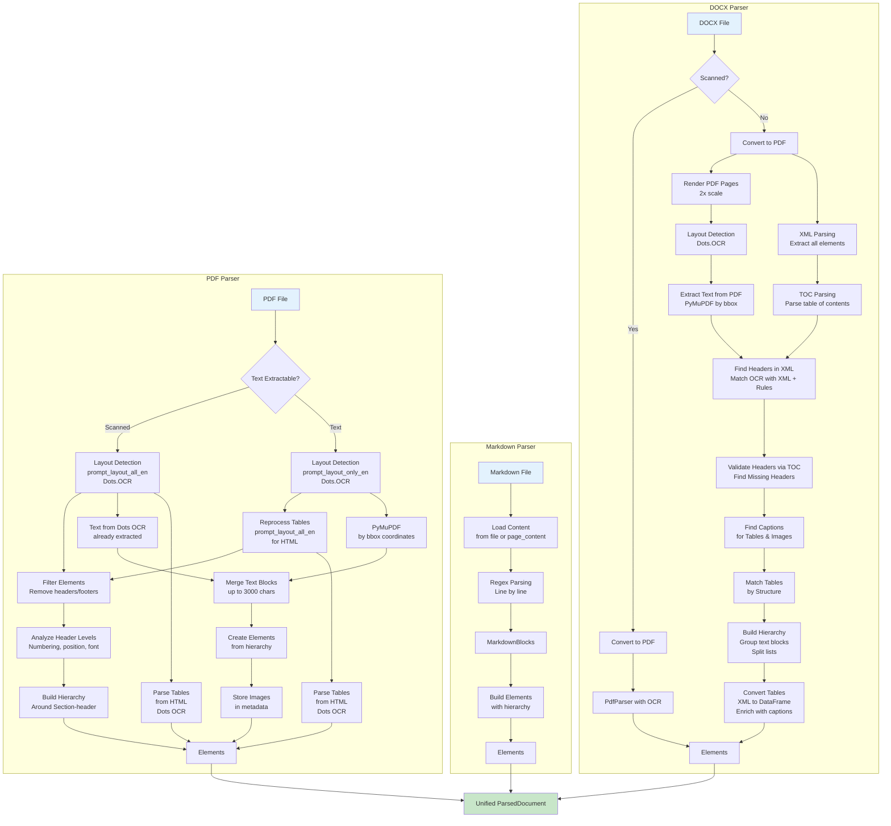
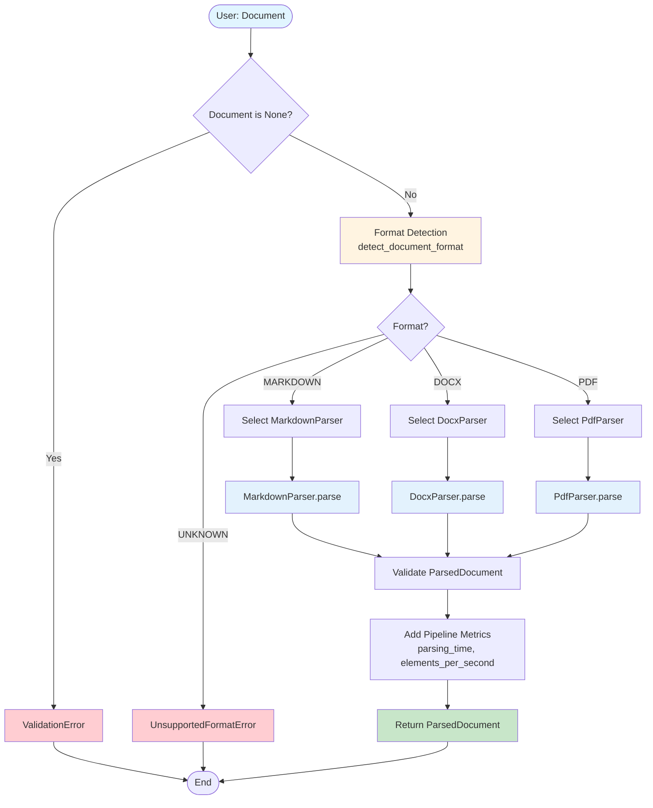

# Documentor Architecture

## System Overview

```mermaid
graph TB
    Start([LangChain Document]) --> Pipeline[Pipeline]
    
    Pipeline --> Loader[DocumentLoader<br/>detect_document_format]
    
    Loader -->|Format Detection| FormatCheck{Document Format}
    
    FormatCheck -->|MARKDOWN| MarkdownParser[MarkdownParser<br/>Regex-based]
    FormatCheck -->|DOCX| DocxParser[DocxParser<br/>Combined: OCR + XML + TOC]
    FormatCheck -->|PDF| PdfParser[PdfParser<br/>Layout-based]
    FormatCheck -->|UNKNOWN| Error[Error:<br/>Unsupported Format]
    
    MarkdownParser -->|Inherits| BaseParser[BaseParser<br/>Abstract Class]
    DocxParser -->|Inherits| BaseParser
    PdfParser -->|Inherits| BaseParser
    
    BaseParser -->|Uses| IdGenerator[ElementIdGenerator<br/>Unique ID Generation]
    
    MarkdownParser -->|Parsing| MarkdownLogic["Parsing Logic:<br/>Headers by #<br/>Tables to DataFrame<br/>Lists with nesting<br/>Quotes, Code blocks<br/>Images, Links"]
    
    DocxParser -->|Parsing| DocxLogic["Parsing Logic:<br/>Layout Detection Dots.OCR<br/>XML Parsing<br/>TOC Validation<br/>Missing Header Detection<br/>Caption Finding<br/>Table Structure Matching<br/>Text Extraction PyMuPDF<br/>Tables to DataFrame<br/>Images"]
    
    PdfParser -->|Parsing| PdfLogic["Parsing Logic:<br/>Layout Detection Dots.OCR<br/>Different Prompts by PDF Type<br/>Text Extraction PyMuPDF or Dots OCR<br/>Table Parsing from HTML<br/>Image Storage<br/>Specialized Processors"]
    
    MarkdownLogic --> Elements[List of Elements]
    DocxLogic --> Elements
    PdfLogic --> Elements
    
    Elements -->|Structuring| Hierarchy[Hierarchy Building<br/>parent_id assignment]
    
    Hierarchy --> ParsedDoc[ParsedDocument<br/>Result]
    
    ParsedDoc --> Output([Output:<br/>Structured Elements])
    
    style Start fill:#e1f5ff
    style Pipeline fill:#fff4e1
    style Loader fill:#e8f5e9
    style BaseParser fill:#f3e5f5
    style MarkdownParser fill:#e3f2fd
    style DocxParser fill:#e3f2fd
    style PdfParser fill:#e3f2fd
    style ParsedDoc fill:#fff9c4
    style Output fill:#c8e6c9
    style Error fill:#ffcdd2
```

## Data Structure

```mermaid
classDiagram
    class Document {
        +str page_content
        +dict metadata
    }
    
    class ParsedDocument {
        +str source
        +DocumentFormat format
        +List~Element~ elements
        +dict metadata
        +to_dicts() List~dict~
        +validate() None
    }
    
    class Element {
        +str id
        +ElementType type
        +str content
        +str parent_id
        +dict metadata
        +validate() None
    }
    
    class ElementType {
        <<enumeration>>
        TITLE
        HEADER_1
        HEADER_2
        HEADER_3
        HEADER_4
        HEADER_5
        HEADER_6
        TEXT
        IMAGE
        TABLE
        FORMULA
        LIST_ITEM
        CAPTION
        FOOTNOTE
        PAGE_HEADER
        PAGE_FOOTER
        LINK
        CODE_BLOCK
    }
    note for ElementType "Matches documentor.domain.models.ElementType. TITLE=document title; HEADER_1..6=section headers; TEXT, TABLE, IMAGE, FORMULA=content; LIST_ITEM, CAPTION, FOOTNOTE, PAGE_HEADER, PAGE_FOOTER, LINK, CODE_BLOCK=other."
    
    class DocumentFormat {
        <<enumeration>>
        MARKDOWN
        PDF
        DOCX
        UNKNOWN
    }
    
    class BaseParser {
        <<abstract>>
        +DocumentFormat format
        +ElementIdGenerator id_generator
        +can_parse(Document) bool
        +parse(Document)* ParsedDocument
        +_validate_input(Document) None
        +_validate_parsed_document(ParsedDocument) None
    }
    
    class MarkdownParser {
        +parse(Document) ParsedDocument
        -_parse_markdown(str) List~MarkdownBlock~
        -_build_elements(List~MarkdownBlock~) List~Element~
        -_parse_table_to_dataframe(List~str~) DataFrame
    }
    
    class DocxParser {
        +parse(Document) ParsedDocument
        -_check_docx_text_content(Path) Dict
        -_extract_text_from_pdf_by_bbox(List~Dict~, Document, float) List~Dict~
    }
    
    class PdfParser {
        +parse(Document) ParsedDocument
        -_is_text_extractable(str) bool
        +layout_processor PdfLayoutProcessor
        +text_extractor PdfTextExtractor
        +table_parser PdfTableParser
        +image_processor PdfImageProcessor
        +hierarchy_builder PdfHierarchyBuilder
    }
    
    class PdfLayoutProcessor {
        +detect_layout_for_all_pages(str, bool) List~Dict~
        +reprocess_tables_with_all_en(str, List~Dict~) List~Dict~
        +filter_layout_elements(List~Dict~) List~Dict~
    }
    
    class PdfTextExtractor {
        +extract_text_by_bboxes(str, List~Dict~, bool) List~Dict~
        +merge_nearby_text_blocks(List~Dict~, int) List~Dict~
    }
    
    class PdfTableParser {
        +parse_tables(List~Element~, str, bool) List~Element~
    }
    
    class PdfImageProcessor {
        +store_images_in_metadata(List~Element~, str) List~Element~
    }
    
    class PdfHierarchyBuilder {
        +analyze_header_levels_from_elements(List~Dict~, str, bool) List~Dict~
        +build_hierarchy_from_section_headers(List~Dict~) Dict
        +create_elements_from_hierarchy(Dict, List~Dict~, List~Dict~, str) List~Element~
    }
    
    class ElementIdGenerator {
        -int _counter
        -int _width
        -str _prefix
        +next_id() str
        +reset(int) None
    }
    
    Document --> ParsedDocument : converted to
    ParsedDocument --> Element : contains
    Element --> ElementType : has type
    ParsedDocument --> DocumentFormat : has format
    BaseParser <|-- MarkdownParser
    BaseParser <|-- DocxParser
    BaseParser <|-- PdfParser
    BaseParser --> ElementIdGenerator : uses
    PdfParser --> PdfLayoutProcessor : uses
    PdfParser --> PdfTextExtractor : uses
    PdfParser --> PdfTableParser : uses
    PdfParser --> PdfImageProcessor : uses
    PdfParser --> PdfHierarchyBuilder : uses
```

## Document Processing Flow

```mermaid
sequenceDiagram
    participant User
    participant Pipeline
    participant Loader as DocumentLoader
    participant Parser as Parser MD/DOCX/PDF
    participant IdGen as ElementIdGenerator
    participant Result as ParsedDocument
    
    User->>Pipeline: Document(page_content, metadata)
    Pipeline->>Pipeline: Check if document is None
    Pipeline->>Loader: detect_document_format(document)
    Loader-->>Pipeline: DocumentFormat
    
    Pipeline->>Pipeline: Select parser by format
    Pipeline->>Parser: parse(document)
    Parser->>Parser: _validate_input(document)
    Parser->>IdGen: next_id()
    IdGen-->>Parser: "00000001"
    
    alt Markdown Parser
        Parser->>Parser: Load content from file if needed
        Parser->>Parser: _parse_markdown(text)
        Parser->>Parser: _build_elements(blocks)
        Parser->>Parser: Create ParsedDocument
    else DOCX Parser
        Parser->>Parser: _check_docx_text_content()
        alt Scanned DOCX
            Parser->>Parser: Convert DOCX to PDF
            Parser->>PdfParser: parse(pdf_document)
            PdfParser-->>Parser: ParsedDocument
        else Normal DOCX
            Parser->>Parser: Convert DOCX to PDF
            Parser->>Parser: Render PDF pages
            Parser->>Parser: Layout Detection Dots.OCR
            Parser->>Parser: Extract text from PDF by bbox PyMuPDF
            Parser->>Parser: XML Parsing
            Parser->>Parser: TOC Parsing
            Parser->>Parser: Find headers in XML
            Parser->>Parser: Validate headers via TOC
            Parser->>Parser: Build hierarchy
            Parser->>Parser: Convert tables to DataFrame
            Parser->>Parser: Create ParsedDocument
        end
    else PDF Parser
        Parser->>Parser: _is_text_extractable()
        Parser->>LayoutProcessor: detect_layout_for_all_pages()
        alt Text-extractable PDF
            LayoutProcessor->>LayoutProcessor: reprocess_tables_with_all_en()
        end
        Parser->>LayoutProcessor: filter_layout_elements()
        Parser->>HierarchyBuilder: analyze_header_levels_from_elements()
        Parser->>HierarchyBuilder: build_hierarchy_from_section_headers()
        Parser->>TextExtractor: extract_text_by_bboxes()
        Parser->>TextExtractor: merge_nearby_text_blocks()
        Parser->>HierarchyBuilder: create_elements_from_hierarchy()
        Parser->>ImageProcessor: store_images_in_metadata()
        Parser->>TableParser: parse_tables(use_dots_ocr_html=True)
        Parser->>Parser: Create ParsedDocument
    end
    
    Parser->>Parser: _validate_parsed_document(result)
    Parser-->>Pipeline: ParsedDocument
    Pipeline->>Pipeline: Add pipeline_metrics to metadata
    Pipeline-->>User: ParsedDocument
```

## Parser Approaches

```mermaid
graph TB
    subgraph "Markdown Parser"
        MD[Markdown File] --> Load[Load Content<br/>from file or page_content]
        Load --> Regex[Regex Parsing<br/>Line by line]
        Regex --> Blocks[MarkdownBlocks]
        Blocks --> Build[Build Elements<br/>with hierarchy]
        Build --> Elements1[Elements]
    end
    
    subgraph "DOCX Parser"
        DOCX[DOCX File] --> Check{Scanned?}
        Check -->|Yes| Convert1[Convert to PDF]
        Convert1 --> PdfParser1[PdfParser with OCR]
        PdfParser1 --> Elements2[Elements]
        Check -->|No| Convert2[Convert to PDF]
        Convert2 --> Render[Render PDF Pages<br/>2x scale]
        Render --> Layout[Layout Detection<br/>Dots.OCR]
        Layout --> Extract[Extract Text from PDF<br/>PyMuPDF by bbox]
        Convert2 --> XML[XML Parsing<br/>Extract all elements]
        XML --> TOC[TOC Parsing<br/>Parse table of contents]
        Extract --> Match[Find Headers in XML<br/>Match OCR with XML + Rules]
        TOC --> Match
        Match --> Validate[Validate Headers via TOC<br/>Find Missing Headers]
        Validate --> Captions[Find Captions<br/>for Tables & Images]
        Captions --> Structure[Match Tables<br/>by Structure]
        Structure --> Hierarchy1[Build Hierarchy<br/>Group text blocks<br/>Split lists]
        Hierarchy1 --> Tables[Convert Tables<br/>XML to DataFrame<br/>Enrich with captions]
        Tables --> Elements2
    end
    
    subgraph "PDF Parser"
        PDF[PDF File] --> TextCheck{Text Extractable?}
        TextCheck -->|Scanned| Layout2a[Layout Detection<br/>prompt_layout_all_en<br/>Dots.OCR]
        TextCheck -->|Text| Layout2b[Layout Detection<br/>prompt_layout_only_en<br/>Dots.OCR]
        Layout2b --> Reprocess[Reprocess Tables<br/>prompt_layout_all_en<br/>for HTML]
        Layout2a --> Filter[Filter Elements<br/>Remove headers/footers]
        Reprocess --> Filter
        Filter --> Analyze[Analyze Header Levels<br/>Numbering, position, font]
        Analyze --> Hierarchy2[Build Hierarchy<br/>Around Section-header]
        Layout2a --> Extract2a[Text from Dots OCR<br/>already extracted]
        Layout2b --> Extract2b[PyMuPDF<br/>by bbox coordinates]
        Extract2a --> Merge[Merge Text Blocks<br/>up to 3000 chars]
        Extract2b --> Merge
        Merge --> Create[Create Elements<br/>from hierarchy]
        Create --> Images[Store Images<br/>in metadata]
        Layout2a --> Tables2a[Parse Tables<br/>from HTML<br/>Dots OCR]
        Reprocess --> Tables2b[Parse Tables<br/>from HTML<br/>Dots OCR]
        Tables2a --> Elements3[Elements]
        Tables2b --> Elements3
        Images --> Elements3
        Hierarchy2 --> Elements3
    end
    
    Elements1 --> Unified[Unified ParsedDocument]
    Elements2 --> Unified
    Elements3 --> Unified
    
    style MD fill:#e3f2fd
    style DOCX fill:#e3f2fd
    style PDF fill:#e3f2fd
    style Unified fill:#c8e6c9
```

## Pipeline Steps

```mermaid
flowchart TD
    Start([User: Document]) --> Validate1{Document is None?}
    Validate1 -->|Yes| Error1[ValidationError]
    Validate1 -->|No| Detect[Format Detection<br/>detect_document_format]
    
    Detect --> Format{Format?}
    Format -->|MARKDOWN| SelectMD[Select MarkdownParser]
    Format -->|DOCX| SelectDOCX[Select DocxParser]
    Format -->|PDF| SelectPDF[Select PdfParser]
    Format -->|UNKNOWN| Error2[UnsupportedFormatError]
    
    SelectMD --> ParseMD[MarkdownParser.parse]
    SelectDOCX --> ParseDOCX[DocxParser.parse]
    SelectPDF --> ParsePDF[PdfParser.parse]
    
    ParseMD --> Validate2[Validate ParsedDocument]
    ParseDOCX --> Validate2
    ParsePDF --> Validate2
    
    Validate2 --> Metrics[Add Pipeline Metrics<br/>parsing_time, elements_per_second]
    Metrics --> Return[Return ParsedDocument]
    
    Error1 --> End([End])
    Error2 --> End
    Return --> End
    
    style Start fill:#e1f5ff
    style Detect fill:#fff4e1
    style ParseMD fill:#e3f2fd
    style ParseDOCX fill:#e3f2fd
    style ParsePDF fill:#e3f2fd
    style Return fill:#c8e6c9
    style Error1 fill:#ffcdd2
    style Error2 fill:#ffcdd2
```
