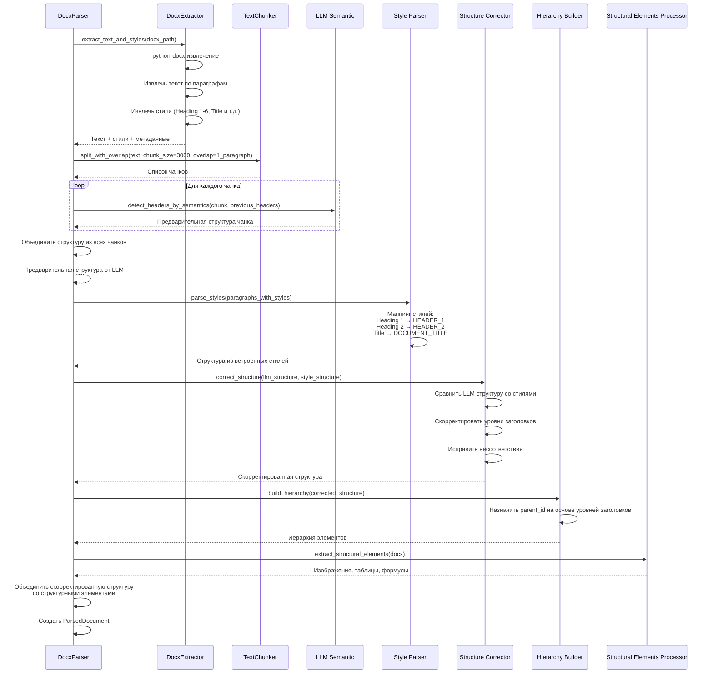
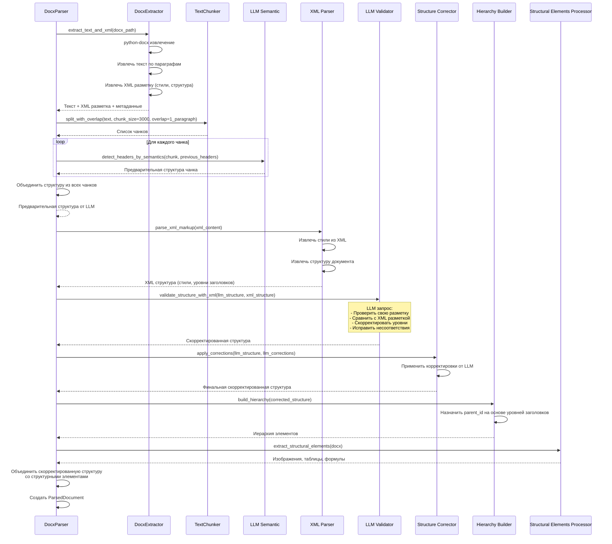
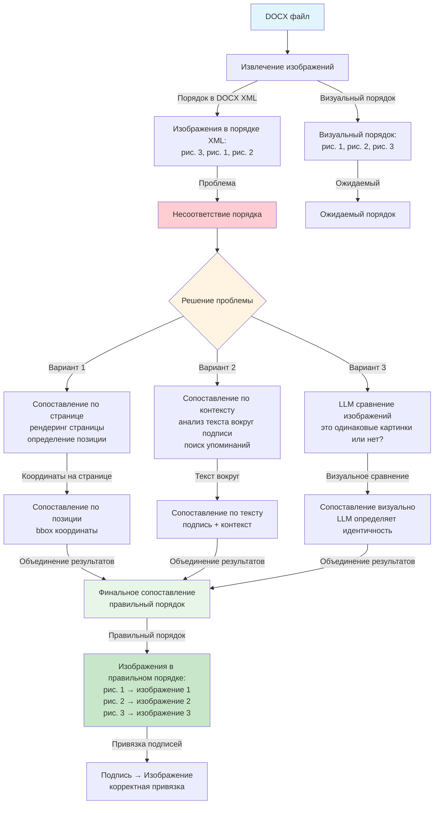
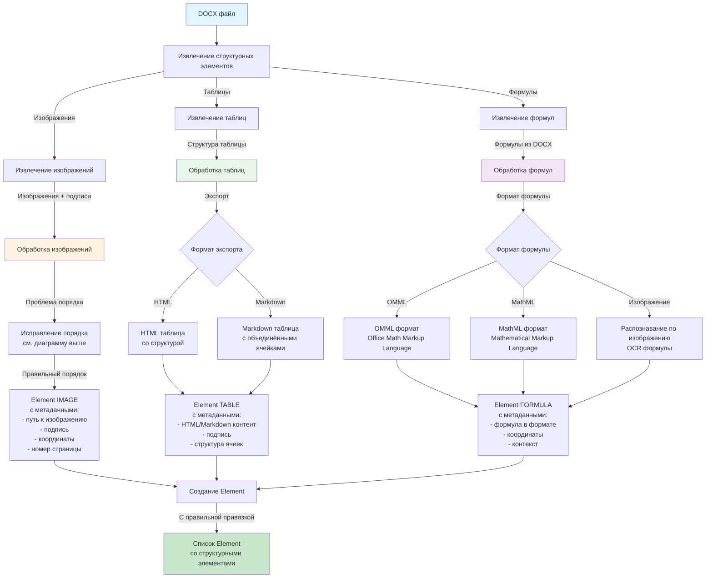
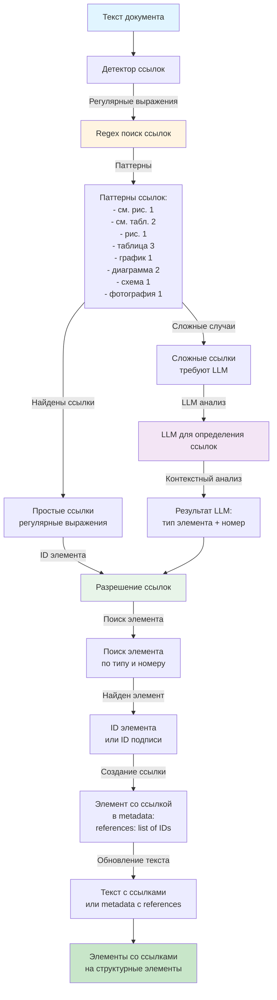
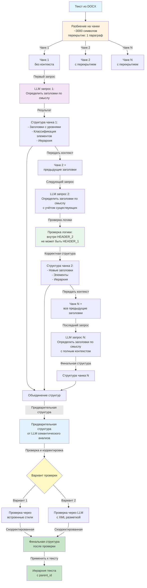
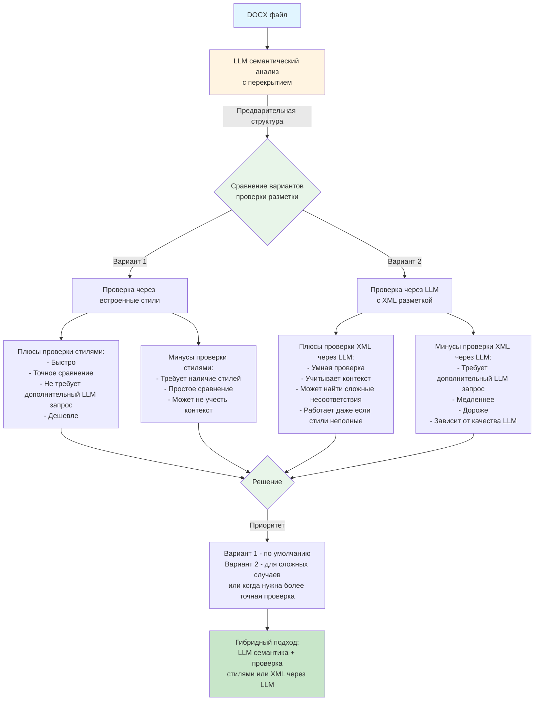

# Реализация DocxParser

## Архитектура DocxParser

```mermaid
graph TB
    Start([LangChain Document<br/>DOCX файл]) --> DocxParser[DocxParser<br/>BaseParser]
    
    DocxParser --> DocxExtractor[Извлечение текста и метаданных<br/>из DOCX<br/>python-docx или аналог]
    
    DocxExtractor -->|Текст + стили + метаданные| TextChunker[Разбиение на чанки<br/>~3000 символов<br/>перекрытие: 1 параграф]
    
    TextChunker -->|Чанки с перекрытием| LLMText[LLM семантический анализ<br/>Qwen или другая модель]
    
    LLMText -->|Запрос к LLM| LLMTextRequest[LLM запрос:<br/>- Найти заголовки по смыслу<br/>- Определить уровни<br/>- Классифицировать элементы<br/>- Выстроить иерархию]
    
    LLMTextRequest -->|Предварительная структура| TextStructure[Структура из семантического анализа]
    
    TextStructure -->|Проверка и корректировка| Strategy{Выбор стратегии<br/>проверки разметки}
    
    Strategy -->|Вариант 1| BuiltInMarkup[Проверка через встроенные стили<br/>Heading 1, Heading 2 и т.д.]
    
    Strategy -->|Вариант 2| LLMXMLCheck[Проверка через LLM<br/>с XML разметкой DOCX]
    
    BuiltInMarkup -->|Стили из DOCX| StyleParser[Парсинг стилей:<br/>- Heading 1 → HEADER_1<br/>- Heading 2 → HEADER_2<br/>- Title → DOCUMENT_TITLE<br/>- Обычный текст → PLAIN_TEXT]
    
    StyleParser -->|Сравнение и корректировка| StyleCorrection[Корректировка структуры:<br/>сравнение LLM результата<br/>со встроенными стилями]
    
    LLMXMLCheck -->|XML разметка DOCX| XMLParser[Извлечение XML разметки<br/>стилей и структуры]
    
    XMLParser -->|XML + LLM структура| LLMXMLRequest[LLM запрос:<br/>- Проверить свою разметку<br/>- Сравнить с XML<br/>- Скорректировать уровни]
    
    LLMXMLRequest -->|Скорректированная структура| XMLCorrection[Корректировка структуры<br/>на основе XML разметки]
    
    StyleCorrection -->|Финальная структура| FinalStructure[Финальная структура<br/>после проверки]
    
    XMLCorrection -->|Финальная структура| FinalStructure
    
    FinalStructure -->|Извлечение структурных элементов| StructuralElements[Структурные элементы:<br/>изображения, таблицы, формулы]
    
    StructuralElements --> ImageProcessor[Обработка изображений]
    StructuralElements --> TableProcessor[Обработка таблиц]
    StructuralElements --> FormulaProcessor[Обработка формул]
    
    ImageProcessor -->|Решение проблемы порядка| ImageOrderFixer[Исправление порядка изображений]
    
    ImageOrderFixer -->|Сопоставление| ImageMatcher[Сопоставление изображений:<br/>- По странице визуально<br/>- По контексту подписи<br/>- LLM сравнение]
    
    TableProcessor -->|Извлечение структуры| TableExtractor[Экспорт таблиц:<br/>HTML/Markdown<br/>объединённые ячейки]
    
    FormulaProcessor -->|Извлечение формул| FormulaExtractor[Формулы:<br/>OMML/MathML<br/>или распознавание по изображению]
    
    FinalStructure --> LinkResolver[Разрешение ссылок<br/>на структурные элементы]
    
    LinkResolver -->|Регулярные выражения| RegexLinker[Поиск ссылок:<br/>см. рис. 1, см. табл. 2]
    
    RegexLinker -->|LLM для сложных случаев| LLMLinker[LLM для определения<br/>ссылок на элементы]
    
    ImageMatcher --> ElementCreator[Создание Element<br/>с id, type, content,<br/>parent_id, metadata]
    TableExtractor --> ElementCreator
    FormulaExtractor --> ElementCreator
    LLMLinker --> ElementCreator
    
    ElementCreator -->|Использует| IdGenerator[ElementIdGenerator<br/>next_id]
    
    ElementCreator --> ElementsList[Список Element<br/>с полной структурой]
    
    ElementsList --> ParsedDoc[ParsedDocument<br/>source, format, elements]
    
    ParsedDoc --> Output([Результат:<br/>Структурированные элементы])
    
    style Start fill:#e1f5ff
    style DocxParser fill:#fff4e1
    style Strategy fill:#e8f5e9
    style BuiltInMarkup fill:#c8e6c9
    style LLMXMLCheck fill:#fff9c4
    style FinalStructure fill:#e3f2fd
    style ImageOrderFixer fill:#f3e5f5
    style ElementCreator fill:#e3f2fd
    style ParsedDoc fill:#fff9c4
    style Output fill:#c8e6c9
```

## Вариант 1: LLM семантика → Проверка через встроенные стили

## Вариант 2: LLM семантика → Проверка через LLM с XML разметкой

## Проблема порядка изображений и решение

## Обработка структурных элементов

## Разрешение ссылок на структурные элементы

## Процесс LLM семантического детектирования заголовков с перекрытием

## Классовая структура DocxParser

```mermaid
classDiagram
    class BaseParser {
        <<abstract>>
        +DocumentFormat format
        +ElementIdGenerator id_generator
        +can_parse(Document) bool
        +parse(Document)* ParsedDocument
    }
    
    class DocxParser {
        +parse(Document) ParsedDocument
        -_parse_with_style_validation(Document) ParsedDocument
        -_parse_with_xml_validation(Document) ParsedDocument
        -_extract_structural_elements(str) dict
    }
    
    class DocxExtractor {
        +extract_text(str) str
        +extract_metadata(str) dict
        +extract_styles(str) dict
        +extract_xml_markup(str) str
        +get_paragraphs(str) List~Paragraph~
    }
    
    class LLMSemanticAnalyzer {
        +detect_headers_by_semantics(str, List~Header~) dict
        +classify_elements(str) List~Element~
        +build_hierarchy(str) dict
    }
    
    class StyleParser {
        +parse_styles(List~Paragraph~) List~Element~
        +map_style_to_element_type(str) ElementType
        +get_header_level(str) int
    }
    
    class StructureCorrector {
        +correct_with_styles(llm_structure, style_structure) dict
        +compare_structures(dict, dict) dict
        +apply_corrections(dict, dict) dict
    }
    
    class XMLParser {
        +parse_xml_markup(str) dict
        +extract_styles_from_xml(str) dict
        +extract_structure_from_xml(str) dict
    }
    
    class LLMValidator {
        +validate_structure_with_xml(llm_structure, xml_structure) dict
        +check_markup_consistency(dict, dict) dict
    }
    
    class ImageOrderFixer {
        +fix_image_order(List~Image~, List~Caption~) List~Image~
        +match_by_page_position(List~Image~) dict
        +match_by_context(List~Image~, str) dict
        +match_by_llm_comparison(List~Image~) dict
    }
    
    class TableExtractor {
        +extract_tables(str) List~Table~
        +export_to_html(Table) str
        +export_to_markdown(Table) str
    }
    
    class FormulaExtractor {
        +extract_formulas(str) List~Formula~
        +convert_omml_to_mathml(OMML) str
        +recognize_from_image(Image) str
    }
    
    class LinkResolver {
        +detect_links(str) List~Link~
        +resolve_references(str, List~Element~) List~Element~
        -_regex_match(str) List~Link~
        -_llm_match(str) List~Link~
    }
    
    class Element {
        +str id
        +ElementType type
        +str content
        +str parent_id
        +dict metadata
    }
    
    BaseParser <|-- DocxParser
    DocxParser --> DocxExtractor : использует для извлечения
    DocxParser --> StyleParser : использует для встроенных стилей
    DocxParser --> LLMSemanticAnalyzer : использует для семантики
    DocxParser --> ImageOrderFixer : использует для изображений
    DocxParser --> TableExtractor : использует для таблиц
    DocxParser --> FormulaExtractor : использует для формул
    DocxParser --> LinkResolver : использует для ссылок
    DocxParser --> Element : создаёт
```

## Сравнение вариантов проверки

