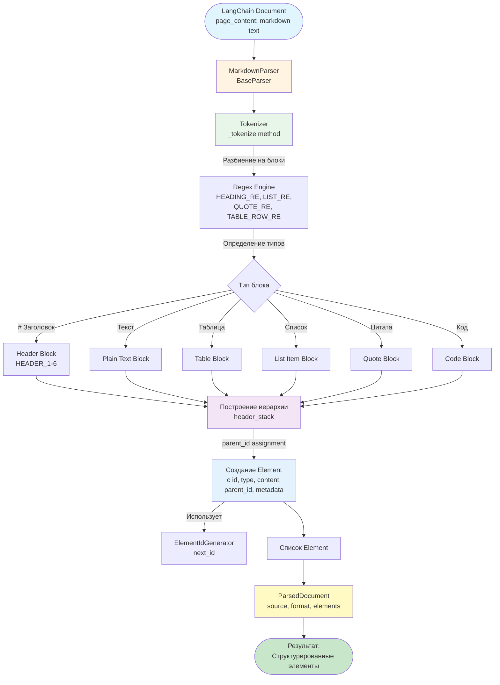
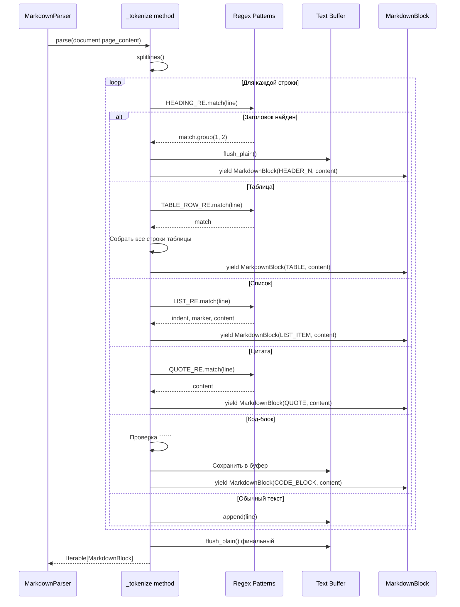
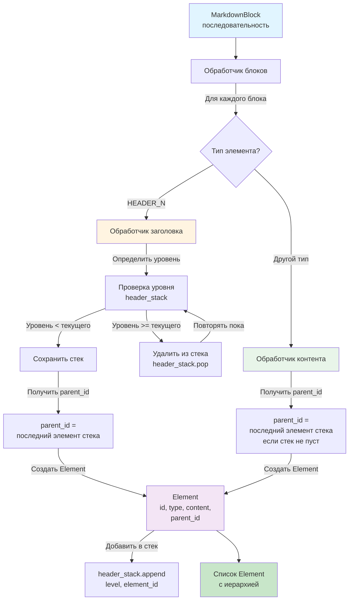
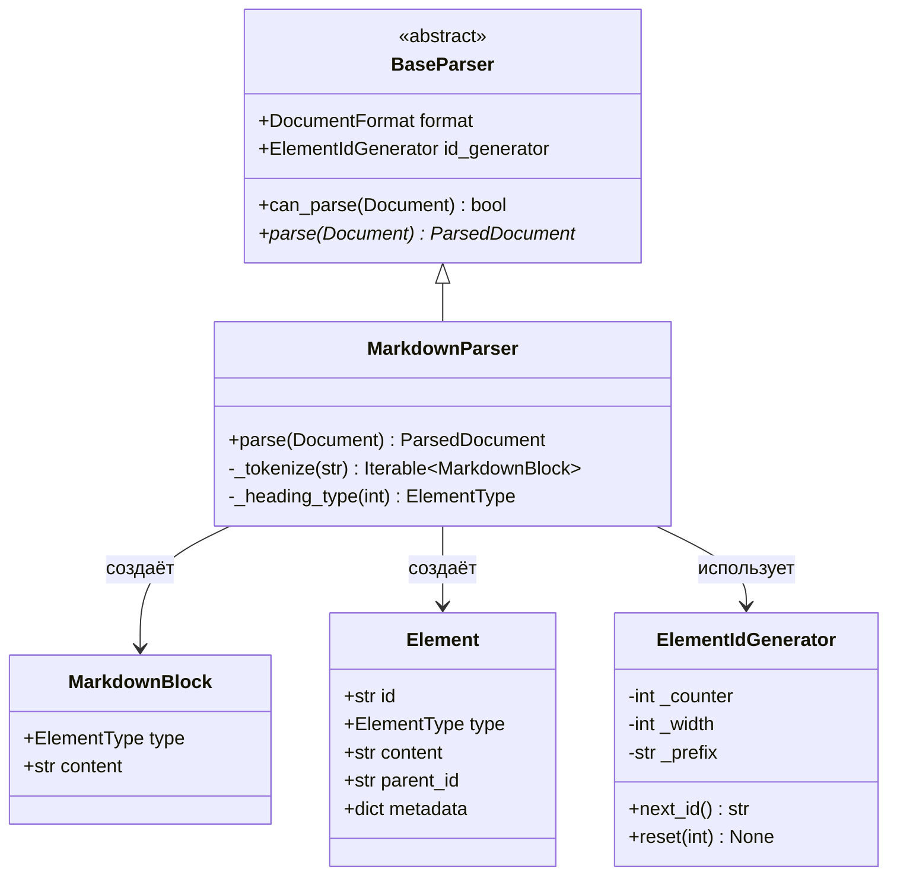

# Реализация MarkdownParser с использованием существующего кода

## Архитектура MarkdownParser

```mermaid
graph TB
    Start([LangChain Document<br/>page_content: markdown text]) --> MarkdownParser[MarkdownParser<br/>BaseParser]
    
    MarkdownParser --> Tokenizer[Tokenizer<br/>_tokenize method]
    
    Tokenizer -->|Разбиение на блоки| RegexEngine[Regex Engine<br/>HEADING_RE, LIST_RE,<br/>QUOTE_RE, TABLE_ROW_RE]
    
    RegexEngine -->|Определение типов| BlockTypes{Тип блока}
    
    BlockTypes -->|# Заголовок| HeaderBlock[Header Block<br/>HEADER_1-6]
    BlockTypes -->|Текст| PlainBlock[Plain Text Block]
    BlockTypes -->|Таблица| TableBlock[Table Block]
    BlockTypes -->|Список| ListBlock[List Item Block]
    BlockTypes -->|Цитата| QuoteBlock[Quote Block]
    BlockTypes -->|Код| CodeBlock[Code Block]
    
    HeaderBlock --> HierarchyBuilder[Построение иерархии<br/>header_stack]
    PlainBlock --> HierarchyBuilder
    TableBlock --> HierarchyBuilder
    ListBlock --> HierarchyBuilder
    QuoteBlock --> HierarchyBuilder
    CodeBlock --> HierarchyBuilder
    
    HierarchyBuilder -->|parent_id assignment| ElementCreator[Создание Element<br/>с id, type, content,<br/>parent_id, metadata]
    
    ElementCreator -->|Использует| IdGenerator[ElementIdGenerator<br/>next_id]
    
    ElementCreator --> ElementsList[Список Element]
    
    ElementsList --> ParsedDoc[ParsedDocument<br/>source, format, elements]
    
    ParsedDoc --> Output([Результат:<br/>Структурированные элементы])
    
    style Start fill:#e1f5ff
    style MarkdownParser fill:#fff4e1
    style Tokenizer fill:#e8f5e9
    style HierarchyBuilder fill:#f3e5f5
    style ElementCreator fill:#e3f2fd
    style ParsedDoc fill:#fff9c4
    style Output fill:#c8e6c9
```

## Детальный процесс токенизации

```mermaid
sequenceDiagram
    participant Parser as MarkdownParser
    participant Tokenizer as _tokenize method
    participant Regex as Regex Patterns
    participant Buffer as Text Buffer
    participant Blocks as MarkdownBlock
    
    Parser->>Tokenizer: parse(document.page_content)
    Tokenizer->>Tokenizer: splitlines()
    
    loop Для каждой строки
        Tokenizer->>Regex: HEADING_RE.match(line)
        alt Заголовок найден
            Regex-->>Tokenizer: match.group(1, 2)
            Tokenizer->>Buffer: flush_plain()
            Tokenizer->>Blocks: yield MarkdownBlock(HEADER_N, content)
        else Таблица
            Tokenizer->>Regex: TABLE_ROW_RE.match(line)
            Regex-->>Tokenizer: match
            Tokenizer->>Tokenizer: Собрать все строки таблицы
            Tokenizer->>Blocks: yield MarkdownBlock(TABLE, content)
        else Список
            Tokenizer->>Regex: LIST_RE.match(line)
            Regex-->>Tokenizer: indent, marker, content
            Tokenizer->>Blocks: yield MarkdownBlock(LIST_ITEM, content)
        else Цитата
            Tokenizer->>Regex: QUOTE_RE.match(line)
            Regex-->>Tokenizer: content
            Tokenizer->>Blocks: yield MarkdownBlock(QUOTE, content)
        else Код-блок
            Tokenizer->>Tokenizer: Проверка ``````
            Tokenizer->>Buffer: Сохранить в буфер
            Tokenizer->>Blocks: yield MarkdownBlock(CODE_BLOCK, content)
        else Обычный текст
            Tokenizer->>Buffer: append(line)
        end
    end
    
    Tokenizer->>Buffer: flush_plain() финальный
    Tokenizer-->>Parser: Iterable[MarkdownBlock]
```

## Построение иерархии элементов

```mermaid
graph TB
    Blocks[MarkdownBlock<br/>последовательность] --> Processor[Обработчик блоков]
    
    Processor -->|Для каждого блока| CheckType{Тип элемента?}
    
    CheckType -->|HEADER_N| HeaderHandler[Обработчик заголовка]
    CheckType -->|Другой тип| ContentHandler[Обработчик контента]
    
    HeaderHandler -->|Определить уровень| LevelCheck[Проверка уровня<br/>header_stack]
    
    LevelCheck -->|Уровень >= текущего| PopStack[Удалить из стека<br/>header_stack.pop]
    LevelCheck -->|Уровень < текущего| KeepStack[Сохранить стек]
    
    PopStack -->|Повторять пока| LevelCheck
    KeepStack -->|Получить parent_id| GetParent[parent_id =<br/>последний элемент стека]
    
    GetParent -->|Создать Element| CreateElement[Element<br/>id, type, content,<br/>parent_id]
    
    CreateElement -->|Добавить в стек| PushStack[header_stack.append<br/>level, element_id]
    
    ContentHandler -->|Получить parent_id| GetParentContent[parent_id =<br/>последний элемент стека<br/>если стек не пуст]
    
    GetParentContent -->|Создать Element| CreateElement
    
    CreateElement --> Elements[Список Element<br/>с иерархией]
    
    style Blocks fill:#e1f5ff
    style HeaderHandler fill:#fff4e1
    style ContentHandler fill:#e8f5e9
    style CreateElement fill:#f3e5f5
    style Elements fill:#c8e6c9
```

## Классовая структура

```mermaid
classDiagram
    class BaseParser {
        <<abstract>>
        +DocumentFormat format
        +ElementIdGenerator id_generator
        +can_parse(Document) bool
        +parse(Document)* ParsedDocument
    }
    
    class MarkdownParser {
        +parse(Document) ParsedDocument
        -_tokenize(str) Iterable~MarkdownBlock~
        -_heading_type(int) ElementType
    }
    
    class MarkdownBlock {
        +ElementType type
        +str content
    }
    
    class Element {
        +str id
        +ElementType type
        +str content
        +str parent_id
        +dict metadata
    }
    
    class ElementIdGenerator {
        -int _counter
        -int _width
        -str _prefix
        +next_id() str
        +reset(int) None
    }
    
    BaseParser <|-- MarkdownParser
    MarkdownParser --> MarkdownBlock : создаёт
    MarkdownParser --> Element : создаёт
    MarkdownParser --> ElementIdGenerator : использует
```

