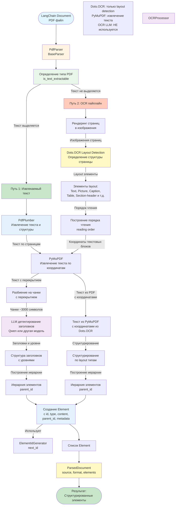
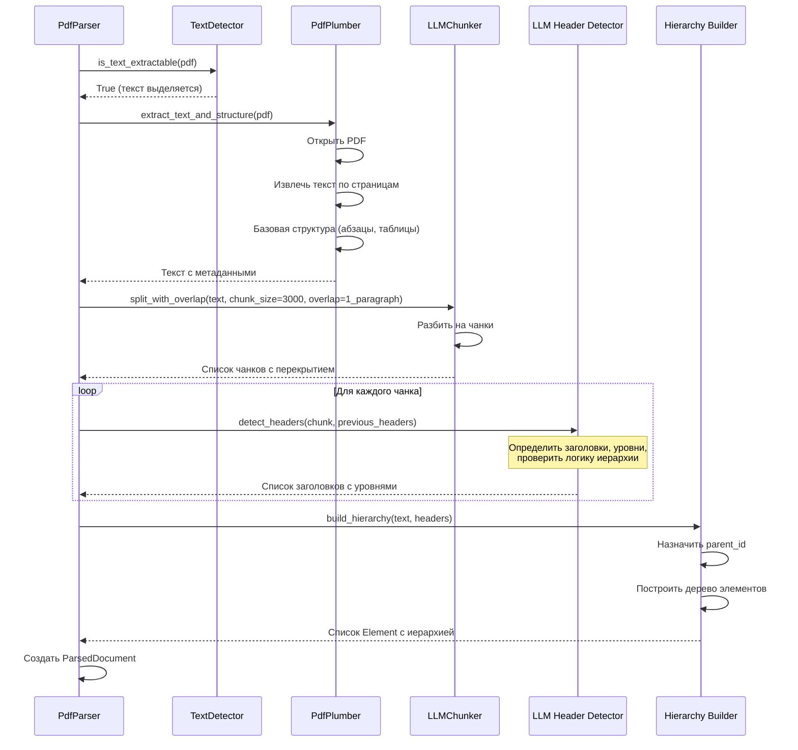
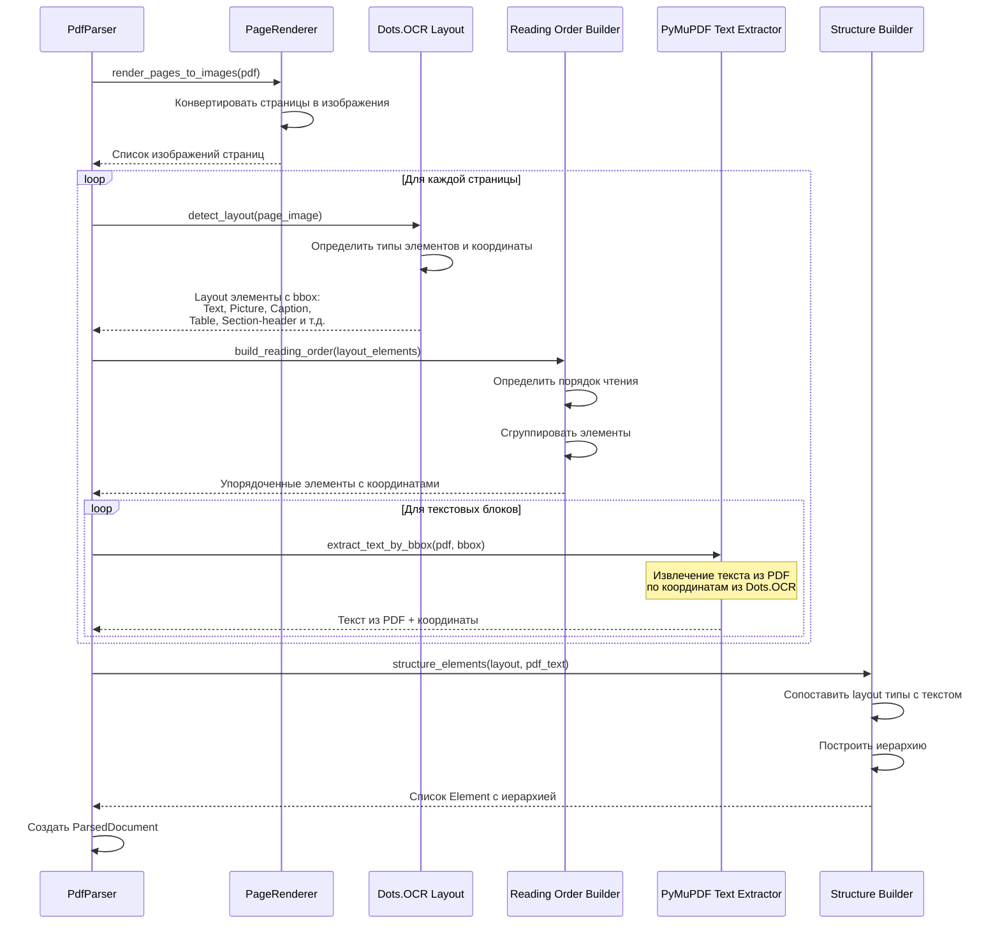
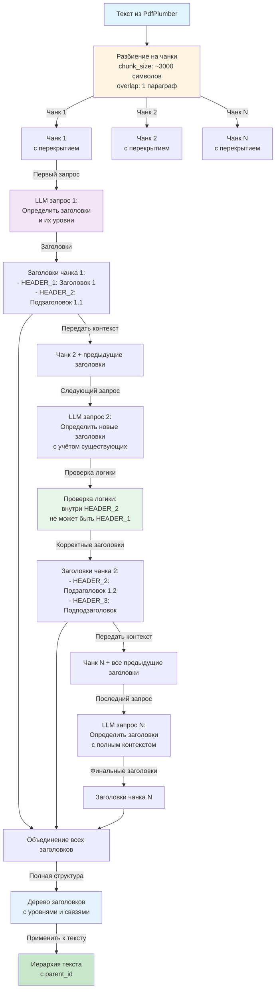
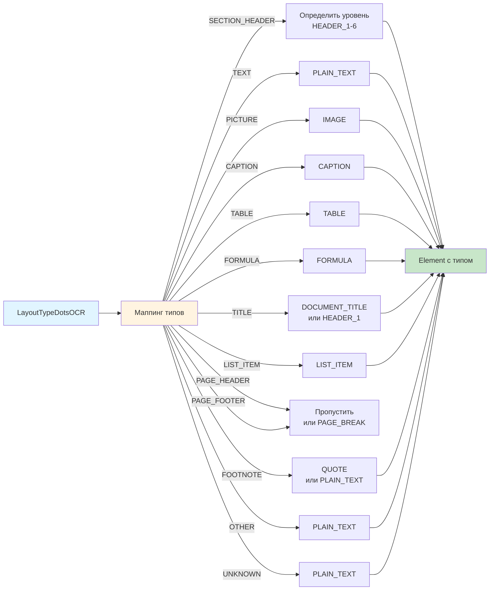
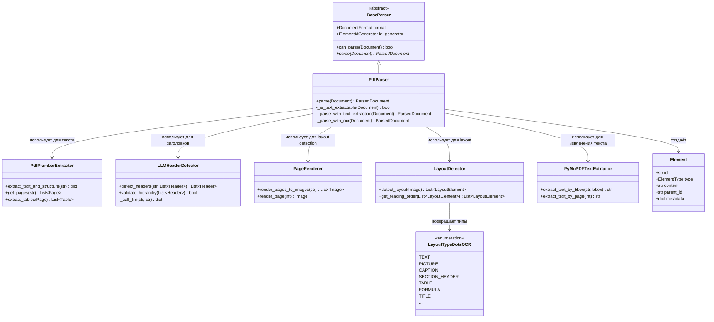
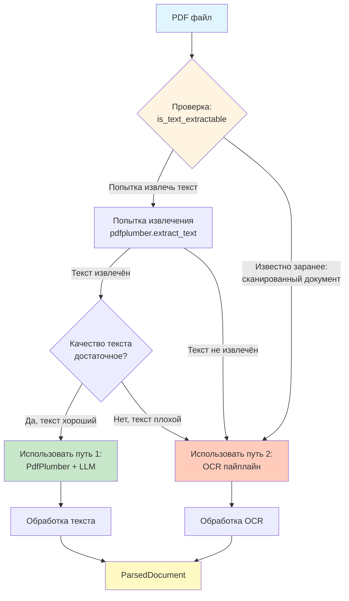

# Реализация PdfParser

## Архитектура PdfParser



## Путь 1: Извлекаемый текст (PdfPlumber + LLM)



## Путь 2: OCR пайплайн (Dots.OCR layout + PyMuPDF text extraction)

**Важно**: Dots.OCR используется ТОЛЬКО для определения layout и координат блоков. Текст извлекается через PyMuPDF по координатам из Dots.OCR. OCR LLM (Qwen OCR) НЕ используется, если текст доступен в PDF.



## Детальная структура OCR пайплайна

```mermaid
graph TB
    PDF[PDF файл] --> Render[Рендеринг страниц]
    
    Render -->|Страница 1| Page1[Изображение страницы 1]
    Render -->|Страница 2| Page2[Изображение страницы 2]
    Render -->|Страница N| PageN[Изображение страницы N]
    
    Page1 --> Layout1[Dots.OCR Layout Detection]
    Page2 --> Layout2[Dots.OCR Layout Detection]
    PageN --> LayoutN[Dots.OCR Layout Detection]
    
    Layout1 -->|Layout элементы| Elements1[Элементы страницы 1:<br/>- Text bbox<br/>- Picture bbox<br/>- Caption bbox<br/>- Table bbox<br/>- Section-header bbox]
    
    Layout2 -->|Layout элементы| Elements2[Элементы страницы 2]
    LayoutN -->|Layout элементы| ElementsN[Элементы страницы N]
    
    Elements1 --> ReadingOrder[Построение порядка чтения<br/>по координатам и типам]
    Elements2 --> ReadingOrder
    ElementsN --> ReadingOrder
    
    ReadingOrder -->|Упорядоченные зоны<br/>с координатами| TextZones[Текстовые блоки<br/>с bbox из Dots.OCR]
    
    TextZones -->|Для каждого текстового блока| PyMuPDFExtract[PyMuPDF<br/>Извлечение текста по bbox]
    
    Note over PyMuPDFExtract: Dots.OCR: только координаты<br/>PyMuPDF: извлечение текста<br/>OCR LLM: НЕ используется
    
    PyMuPDFExtract -->|Текст из PDF| OCRResults[Результаты:<br/>текст из PyMuPDF + bbox + page_num]
    
    OCRResults --> StructureBuilder[Структурирование элементов]
    
    StructureBuilder -->|По layout типам| TypeMapping[Маппинг типов:<br/>Section-header → HEADER_N<br/>Text → PLAIN_TEXT<br/>Picture → IMAGE<br/>Caption → CAPTION<br/>Table → TABLE]
    
    TypeMapping -->|С построением иерархии| HierarchyBuilder[Построение иерархии<br/>parent_id по уровням заголовков]
    
    HierarchyBuilder --> Elements[Список Element<br/>с полной структурой]
    
    style PDF fill:#e1f5ff
    style Layout1 fill:#fff4e1
    style ReadingOrder fill:#e8f5e9
    style PyMuPDFExtract fill:#e3f2fd
    style StructureBuilder fill:#e3f2fd
    style Elements fill:#c8e6c9
```

## LLM детектирование заголовков с перекрытием



## Маппинг типов Layout → ElementType



## Классовая структура PdfParser



## Процесс принятия решения: текст или OCR


