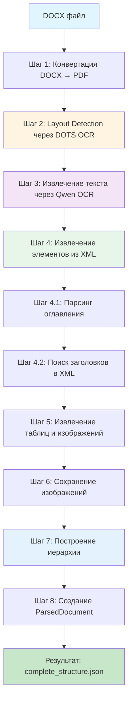

# Полное описание пайплайна обработки DOCX документов

## Обзор

Пайплайн `docx_complete_pipeline.py` представляет собой комплексное решение для извлечения структурированной информации из DOCX документов. Он объединяет возможности OCR (DOTS OCR и Qwen OCR) с прямым парсингом XML для создания полной иерархической структуры документа.

**Основной принцип:** Использовать OCR для обнаружения структурных элементов (заголовки, подписи), а XML для извлечения полного контента (текст, таблицы, изображения).

---

## Архитектура пайплайна



---

## Детальное описание этапов

### Шаг 1: Конвертация DOCX → PDF

**Функция:** `convert_docx_to_pdf(docx_path, temp_pdf_path)`

**Цель:** Создать PDF версию документа для последующего анализа через OCR.

**Методы конвертации (в порядке приоритета):**
1. **Word COM (Windows)** - использует Microsoft Word через COM интерфейс
2. **LibreOffice** - через командную строку
3. **docx2pdf** - Python библиотека (fallback)

**Особенности:**
- PDF создается во временной директории
- Используется для рендеринга страниц в изображения
- Необходим для работы DOTS OCR

**Выходные данные:**
- `temp.pdf` - временный PDF файл

---

### Шаг 2: Layout Detection через DOTS OCR

**Функция:** `process_layout_detection(image, origin_image)`

**Цель:** Обнаружить структурные элементы документа (заголовки, подписи, изображения, таблицы) на каждой странице.

**Параметры:**
- `RENDER_SCALE = 2.0` - увеличение для лучшего качества OCR
- Обработка каждой страницы отдельно

**Обнаруживаемые элементы:**
- **Section-header** - заголовки разделов
- **Caption** - подписи к таблицам и изображениям
- **Image/Figure** - изображения
- **Table** - таблицы

**Процесс:**
1. Рендеринг страницы в изображение с увеличением 2x
2. Отправка изображения в DOTS OCR API
3. Получение bounding boxes для каждого элемента
4. Сохранение координат и категорий элементов

**Выходные данные:**
- `ocr_elements` - список элементов с координатами и категориями
- `page_images` - словарь изображений страниц (для последующего OCR)

**Статистика:**
- Количество найденных Section-header
- Количество найденных Caption
- Количество найденных изображений

---

### Шаг 3: Извлечение текста через Qwen OCR

**Функция:** `extract_text_from_ocr_elements_with_qwen(ocr_elements, page_images)`

**Цель:** Извлечь точный текст из заголовков и подписей, обнаруженных DOTS OCR.

**Обрабатываемые элементы:**
- Только `Section-header` и `Caption`
- Изображения и таблицы пропускаются

**Процесс:**
1. Для каждого элемента вырезается область из изображения страницы по bbox
2. Вырезанное изображение отправляется в Qwen OCR
3. Извлеченный текст сохраняется вместе с метаданными элемента

**Особенности:**
- Используется padding (10px) при вырезании для лучшего качества
- Обрабатываются только элементы с валидными bbox
- Текст нормализуется (strip)

**Выходные данные:**
- `headers_with_text` - заголовки с извлеченным текстом
- `captions_with_text` - подписи с извлеченным текстом

**Статистика:**
- Количество заголовков с текстом
- Количество подписей с текстом

---

### Шаг 4: Извлечение элементов из XML

#### Шаг 4.1: Парсинг оглавления

**Функция:** `parse_toc_from_docx(docx_path, all_xml_elements)`

**Цель:** Извлечь заголовки из оглавления документа для дополнительной проверки и определения уровней.

**Методы парсинга (в порядке приоритета):**

1. **Парсинг через PAGEREF (динамические поля)**
   - Функция: `parse_toc_from_field_simple(root)`
   - Ищет `w:instrText` с инструкциями `PAGEREF`
   - Извлекает имена закладок (`_Toc\d+`)
   - Находит соответствующие закладки в XML
   - Извлекает текст заголовка и определяет уровень

2. **Парсинг через стили TOC**
   - Функция: `parse_toc_from_styles_simple(root)`
   - Ищет параграфы со стилями `TOC1`, `TOC2`, `TOC3`
   - Определяет уровень по номеру стиля
   - Извлекает текст и номер страницы

3. **Парсинг через параграфы между заголовками**
   - Функция: `parse_toc_from_paragraphs_simple(all_elements, toc_header_pos, next_header_pos)`
   - Ищет раздел между "Содержание"/"Оглавление" и следующим крупным заголовком
   - Парсит строки с точками-лидерами и номерами страниц
   - Определяет уровень по нумерации (1. → level 1, 1.1 → level 2, и т.д.)

**Вспомогательные функции:**
- `get_paragraph_text_from_xml(p)` - извлекает текст из параграфа XML
- `get_paragraph_style_from_xml(p)` - получает стиль параграфа
- `find_bookmark_text_in_xml(root, bookmark_name)` - находит текст заголовка по закладке

**Выходные данные:**
- `toc_entries` - список заголовков из оглавления
- `toc_headers_map` - словарь для быстрого поиска: `{normalized_title: {level, page, original_title}}`

**Использование оглавления:**
1. **Определение уровня заголовков** - приоритет над другими методами
2. **Поиск пропущенных заголовков** - если заголовок есть в оглавлении, но не найден через OCR
3. **Валидация найденных заголовков** - проверка правильности уровней

#### Шаг 4.2: Поиск заголовков в XML и построение правил

**Функция:** `find_header_in_xml_by_text(header_text, all_xml_elements, start_from, docx_path, header_rules)`

**Цель:** Найти заголовки, обнаруженные через OCR, в XML структуре документа.

**Процесс поиска:**
1. Сортировка заголовков по странице и позиции (сверху вниз)
2. Для каждого заголовка:
   - Поиск в XML от последней найденной позиции + 1 (последовательный поиск)
   - Если не найден, поиск от начала документа
   - Извлечение свойств параграфа из XML

**Фильтрация ложных заголовков:**
- Элементы списка (если не нумерованный заголовок и не заголовок по стилю)
- Определения ("Термин – описание")
- Разделители ("……………………………………………………….399")
- Элементы списка по паттерну ("1) ФИО;", "а) текст")

**Определение уровня заголовка (приоритет):**
1. **Из оглавления** - если заголовок найден в `toc_headers_map`
2. **Из стиля** - если параграф имеет стиль заголовка (Heading 1-6, стили "1", "2", "3")
3. **По нумерации** - анализ паттерна нумерации (1. → level 1, 1.1 → level 2, 1.1.1 → level 3)

**Поиск пропущенных заголовков:**
- Если заголовок не найден через OCR, но есть в оглавлении - поиск в XML по тексту из оглавления
- Добавление найденных заголовков в `header_positions`

**Построение правил:**
- Функция: `build_header_rules_from_found_headers(docx_path, header_positions)`
- Анализирует свойства найденных заголовков (шрифт, размер, жирность, стиль, выравнивание)
- Создает правила для каждого уровня заголовков
- Фильтрует нерелевантные свойства (например, нежирный текст для уровня 3)

**Выходные данные:**
- `header_positions` - список найденных заголовков с позициями в XML
- `header_rules` - правила для поиска пропущенных заголовков

---

### Шаг 4.3: Поиск пропущенных заголовков

**Функция:** `find_missing_headers_by_rules(docx_path, all_xml_elements, header_rules, found_positions, found_texts, header_positions)`

**Цель:** Найти заголовки, которые были пропущены OCR, используя правила на основе найденных заголовков.

**Процесс:**
1. Итерация по всем элементам XML
2. Для каждого элемента:
   - Проверка, не является ли он уже найденным заголовком
   - Извлечение свойств параграфа
   - Сравнение свойств с правилами для каждого уровня
   - Подсчет score на основе совпадений

**Параметры сравнения:**
- `style_pattern` (вес 3.0) - совпадение стиля заголовка
- `font_name` - совпадение шрифта
- `font_size` - близость размера шрифта
- `is_bold` - жирность текста
- `alignment` - выравнивание текста
- `is_heading_style` - наличие стиля заголовка
- `is_numbered_header` - нумерованный паттерн
- `is_structural_keyword` - ключевые слова ("Введение", "Заключение", и т.д.)
- `is_short_bold_text` - короткий жирный текст

**Фильтрация:**
- Тексты, заканчивающиеся на ":"
- Определения ("Термин – описание")
- Разделители
- Элементы списка
- Метаданные документа
- Заголовки списков

**Проверка последовательной нумерации:**
- Перед добавлением заголовка проверяется, не является ли он частью списка
- Если найден паттерн последовательной нумерации (1., 2., 3., ...) - пропускается

**Пост-фильтрация:**
- Удаление цепочек из 2+ последовательных заголовков одного уровня с последовательной нумерацией

**Проверка оглавления:**
- Если заголовок найден по правилам и есть в оглавлении - используется уровень из оглавления

**Выходные данные:**
- `missing_headers` - список найденных пропущенных заголовков

---

### Шаг 4.4: Поиск captions и построение правил

**Функция:** `find_caption_before_element()`, `find_caption_after_element()`

**Цель:** Найти подписи к таблицам и изображениям в XML.

**Процесс:**
1. Для каждой подписи из OCR:
   - Поиск в XML от последней найденной позиции
   - Проверка паттернов подписей (`is_table_caption`, `is_image_caption`)
   - Извлечение свойств параграфа

2. Построение правил:
   - Функция: `build_caption_rules_from_found_captions(docx_path, caption_positions)`
   - Анализ выравнивания, размера шрифта, жирности
   - Создание правил для идентификации captions

**Паттерны подписей:**
- Таблицы: "Таблица 1", "Table 1", "Табл. 1", "Tbl. 1"
- Изображения: "Рис. 1", "Рисунок 1", "Figure 1", "Fig. 1", "Изображение 1"

**Особенности:**
- Подписи не должны заканчиваться на ":"
- Паттерн должен быть в начале текста
- Фильтрация очень коротких текстов (< 5 символов)

**Выходные данные:**
- `caption_positions` - список найденных подписей с позициями
- `caption_rules` - правила для поиска подписей

---

### Шаг 5: Извлечение таблиц и изображений из XML

**Функции:**
- `extract_tables_from_docx_xml(docx_path)` - извлечение таблиц
- `extract_images_from_docx_xml(docx_path)` - извлечение изображений

**Извлечение таблиц:**
- Парсинг `w:tbl` элементов из `word/document.xml`
- Обработка объединенных ячеек (colspan, rowspan)
- Извлечение текста из каждой ячейки
- Сохранение структуры таблицы (строки, колонки, данные)
- Определение `xml_position` для каждой таблицы

**Извлечение изображений:**
- Поиск `a:blip` элементов в XML
- Извлечение связей изображений из `word/_rels/document.xml.rels`
- Извлечение байтов изображений из `word/media/`
- Определение `xml_position` (позиция параграфа, содержащего изображение)
- Сохранение полного пути к изображению

**Особенности:**
- Таблицы извлекаются в правильном порядке появления в документе
- Изображения извлекаются в правильном порядке (не по имени файла, а по порядку в XML)
- Поддержка объединенных ячеек в таблицах
- Сохранение метаданных (стили таблиц, размеры изображений)

**Выходные данные:**
- `docx_tables` - список таблиц с данными и метаданными
- `docx_images` - список изображений с байтами и метаданными

---

### Шаг 6: Сохранение изображений из media

**Цель:** Сохранить изображения из DOCX в отдельную директорию с понятными именами.

**Процесс:**
1. Создание директории `images/` в выходной директории
2. Сортировка изображений по `xml_position`
3. Для каждого изображения:
   - Определение индекса изображения (1, 2, 3, ...)
   - Сопоставление с OCR изображениями для определения номера страницы
   - Сохранение с именем `Image X.png`
   - Сохранение метаданных (оригинальный путь, номер страницы)

**Особенности:**
- Изображения сохраняются в формате PNG
- Конвертация в RGB, если необходимо
- Сохранение информации о номере страницы из OCR

**Выходные данные:**
- `saved_images_map` - словарь: `{xml_position: {saved_name, page_num, image_index}}`
- Файлы изображений в директории `images/`

---

### Шаг 7: Построение иерархии документа

**Функция:** `build_hierarchy_from_headers(...)`

**Цель:** Создать полную иерархическую структуру документа из всех элементов XML.

**Ключевой принцип:** Обработка ВСЕХ элементов XML строго по порядку `xml_position`. Каждый элемент либо добавляется в результат, либо является пустым. Ничего не пропускается.

#### Предварительная подготовка

**Индексы:**
- `header_by_pos` - словарь: `{xml_position: header_data}`
- `tables_by_position` - словарь: `{xml_position: table_data}`
- `images_by_position` - словарь: `{xml_position: image_data}`

**Кэширование:**
- `properties_cache` - кэш свойств параграфов (чтобы не открывать ZIP повторно)

**Параметры:**
- `MAX_TEXT_BLOCK_SIZE = 3000` - максимальный размер текстового блока
- `MAX_PARAGRAPHS_PER_BLOCK = 10` - максимальное количество параграфов в блоке

#### Обработка элементов

**Итерация по `all_xml_elements`:**

Для каждого элемента проверяется его тип и обрабатывается соответственно:

1. **Изображения** (приоритет 1)
   - Если элемент содержит изображение (`has_image` флаг или найден в `images_by_position`)
   - Поиск подписи до или после изображения
   - Создание элемента `IMAGE`
   - Если найдена подпись - связывание изображения с подписью (`parent_id`)

2. **Таблицы**
   - Если элемент является таблицей (найден в `tables_by_position`)
   - Поиск подписи до таблицы
   - Извлечение данных таблицы (с поддержкой объединенных ячеек)
   - Создание элемента `TABLE`

3. **Заголовки**
   - Если элемент найден в `header_by_pos` или определен как заголовок по свойствам
   - Определение уровня заголовка
   - Обновление стека заголовков (`header_stack`)
   - Создание элемента `HEADER_1`, `HEADER_2`, `HEADER_3`, и т.д.

4. **Элементы списка**
   - Проверка свойства `is_list_item` из XML
   - Создание элемента `LIST_ITEM`

5. **Текстовые блоки**
   - Накопление параграфов в `current_text_block`
   - Разбиение по `\n\n` и проверка каждого под-блока на заголовок
   - Если под-блок является заголовком - разделение на заголовок и текст
   - Сохранение блока при достижении лимитов размера или количества параграфов

#### Вспомогательные функции

**`flush_text_block()`:**
- Сохраняет накопленный текстовый блок
- Обнаруживает последовательности нумерованных элементов (1., 2., 3., ...)
- Разбивает их на отдельные `LIST_ITEM` элементы
- Сохраняет текст до и после списка отдельно

**`add_header_element(text, level, xml_pos, ...)`:**
- Создает элемент заголовка
- Обновляет стек заголовков
- Определяет `parent_id` на основе стека

**`determine_header_level(text, properties, header_stack)`:**
- Определяет уровень заголовка на основе:
  - Нумерации (приоритет)
  - Структурных ключевых слов ("Введение", "Заключение" → level 1)
  - Паттернов глав/частей ("Глава X" → level 1)
  - Стеке предыдущих заголовков
  - Свойств (жирность, стиль)

**`is_header_by_properties(properties, text)`:**
- Проверяет, является ли элемент заголовком по свойствам
- Учитывает: стиль заголовка, нумерацию, жирность, размер шрифта, Caps Lock

#### Обработка подписей

- Подписи обрабатываются вместе с таблицами и изображениями
- Создаются элементы `CAPTION`
- Связываются с соответствующими таблицами/изображениями через `parent_id`

#### Пост-обработка

**Связывание изображений с подписями:**
- Итерация по всем элементам
- Если найден элемент `IMAGE`:
  - Поиск соседнего элемента `CAPTION` (до или после)
  - Если найдена подпись:
    - Установка `parent_id` изображения = ID подписи
    - Перемещение метаданных изображения в метаданные подписи

**Определение содержания:**
- Обнаружение раздела "Содержание"/"Оглавление"
- Маркировка элементов как часть содержания

**Выходные данные:**
- `elements` - список элементов `Element` с полной иерархией
- Каждый элемент имеет: `id`, `type`, `content`, `parent_id`, `metadata`

---

### Шаг 8: Создание ParsedDocument и сохранение результатов

**Создание ParsedDocument:**
```python
parsed_doc = ParsedDocument(
    source=str(docx_path),
    format=DocumentFormat.DOCX,
    elements=elements,
    metadata={...}
)
```

**Сохранение результатов:**

1. **OCR информация** (`ocr_info.json`):
   - Количество найденных Section-header и Caption
   - Примеры заголовков и подписей (первые 10)
   - Описание категорий

2. **Полная структура** (`complete_structure.json`):
   - Метаданные документа
   - Список всех элементов с полным контентом
   - Статистика (количество заголовков, текстовых блоков, таблиц, изображений)

**Структура JSON:**
```json
{
  "source": "путь к файлу",
  "format": "DOCX",
  "metadata": {
    "total_headers": 46,
    "total_tables": 10,
    "total_images": 0,
    "total_pages": 69
  },
  "elements": [
    {
      "id": "00000001",
      "type": "header_1",
      "content": "ВВЕДЕНИЕ",
      "parent_id": null,
      "metadata": {...}
    },
    ...
  ],
  "statistics": {...}
}
```

---

## Ключевые функции и их назначение

### Функции фильтрации и проверки

**`is_table_caption(text)`** - проверяет, является ли текст подписью к таблице
- Паттерны: "Таблица 1", "Table 1", "Табл. 1", "Tbl. 1"
- Текст не должен заканчиваться на ":"
- Паттерн должен быть в начале текста

**`is_image_caption(text)`** - проверяет, является ли текст подписью к изображению
- Паттерны: "Рис. 1", "Рисунок 1", "Figure 1", "Fig. 1", "Изображение 1"
- Аналогичные ограничения

**`is_structural_keyword(text)`** - определяет ключевые структурные слова
- "Введение", "Заключение", "Список литературы", "Реферат", "Содержание", и т.д.
- Используется для определения уровня 1 заголовков

**`is_definition_pattern(text)`** - обнаруживает паттерны определений
- "Термин – описание"
- Фильтрует такие тексты из заголовков

**`is_separator_line(text)`** - обнаруживает разделительные линии
- "……………………………………………………….399"
- Фильтрует из заголовков

**`is_list_item_pattern(text)`** - обнаруживает элементы списка по паттерну
- "1) текст", "а) текст", "- текст", "• текст"
- Фильтрует из заголовков

**`is_document_metadata(text)`** - обнаруживает метаданные документа
- "Отчет 98 с., 1 кн., 16 рис."
- Фильтрует из заголовков

**`is_list_header(text)`** - обнаруживает заголовки списков
- "На этапе 1 выполнены следующие работы."
- Фильтрует из заголовков

**`is_chapter_part_section_header(text)`** - обнаруживает заголовки глав/частей
- "Глава X", "Часть X", "Раздел X"
- Определяет как level 1

**`is_mostly_uppercase(text)`** - проверяет, написано ли большинство букв заглавными
- Используется как дополнительный признак заголовка

### Функции извлечения свойств

**`extract_paragraph_properties_from_xml(docx_path, xml_position)`** - извлекает свойства параграфа
- Шрифт, размер, жирность, курсив, стиль
- Выравнивание текста
- Является ли заголовком по стилю
- Является ли элементом списка
- Уровень заголовка (если есть)

**Особенности:**
- Кэширование результатов для производительности
- Правильная обработка атрибутов `val` для жирности/курсива
- Определение стилей "1", "2", "3" как заголовков

### Функции поиска

**`find_header_in_xml_by_text(header_text, all_xml_elements, start_from, docx_path, header_rules)`** - находит заголовок в XML
- Поиск от указанной позиции
- Нечеткое сравнение текста (нормализация пробелов)
- Проверка свойств для подтверждения
- Использование информации о странице из OCR для сужения поиска

**`find_caption_before_element(...)`** - находит подпись до элемента
- Поиск от позиции элемента назад
- Применение правил подписей
- Проверка выравнивания и других свойств

**`find_caption_after_element(...)`** - находит подпись после элемента
- Аналогично, но поиск вперед

### Функции построения правил

**`build_header_rules_from_found_headers(docx_path, header_positions)`** - строит правила для поиска заголовков
- Группировка заголовков по уровням
- Вычисление общих свойств для каждого уровня
- Фильтрация нерелевантных свойств
- Сохранение правил для каждого уровня

**`build_caption_rules_from_found_captions(docx_path, caption_positions)`** - строит правила для поиска подписей
- Анализ выравнивания, размера шрифта, жирности
- Создание правил для идентификации captions

---

## Особенности реализации

### Последовательные ID элементов

- Используются последовательные числовые ID: `00000001`, `00000002`, и т.д.
- Вместо UUID для лучшей читаемости и отслеживания

### Кэширование свойств параграфов

- `properties_cache` предотвращает повторное открытие ZIP файла
- Значительно улучшает производительность

### Обработка текстовых блоков

- Текстовые блоки разбиваются по `\n\n`
- Каждый под-блок проверяется на заголовок
- Если под-блок является заголовком - разделяется
- Если нет - объединяется обратно в текстовый блок

### Обнаружение списков

- Последовательности нумерованных элементов (1., 2., 3., ...) автоматически разбиваются на `LIST_ITEM`
- Сохраняется порядок: текст до списка → элементы списка → текст после списка

### Определение уровня заголовков

**Приоритет:**
1. Нумерация (1. → level 1, 1.1 → level 2, 1.1.1 → level 3)
2. Структурные ключевые слова → level 1
3. Паттерны глав/частей → level 1
4. Стек предыдущих заголовков
5. Свойства (жирность, стиль)

**Предотвращение эскалации уровней:**
- Соседние жирные заголовки без нумерации получают одинаковый уровень
- Проверка на последовательную нумерацию перед определением уровня

### Связывание изображений с подписями

- Изображения связываются с подписями через `parent_id`
- Метаданные изображения хранятся в метаданных подписи
- Подпись является родителем изображения

---

## Формат выходных данных

### Структура элемента

```json
{
  "id": "00000001",
  "type": "header_1",
  "content": "Полный текст элемента",
  "parent_id": null,
  "metadata": {
    "xml_position": 23,
    "text_source": "xml",
    "from_toc": true,
    "level": 1,
    ...
  }
}
```

### Типы элементов

- `header_1`, `header_2`, `header_3`, `header_4`, `header_5`, `header_6` - заголовки
- `text` - текстовые блоки
- `table` - таблицы
- `image` - изображения
- `caption` - подписи
- `list_item` - элементы списка

### Метаданные

**Для заголовков:**
- `xml_position` - позиция в XML
- `text_source` - источник текста ("xml")
- `from_toc` - найден ли через оглавление
- `level` - уровень заголовка
- `is_numbered_header` - является ли нумерованным
- `ocr_detected_as_header` - обнаружен ли через OCR

**Для текстовых блоков:**
- `xml_positions` - список позиций параграфов
- `text_source` - источник ("xml")
- `size` - размер текста

**Для таблиц:**
- `xml_position` - позиция таблицы
- `rows_count`, `cols_count` - размеры
- `data` - данные таблицы
- `merged_cells` - информация об объединенных ячейках

**Для изображений:**
- `xml_position` - позиция изображения
- `image_path` - путь в DOCX (media/image7.png)
- `saved_name` - сохраненное имя (Image 7.png)
- `page_num` - номер страницы из OCR

**Для подписей:**
- `xml_position` - позиция подписи
- `image_metadata` - метаданные связанного изображения (если есть)

---

## Параметры и настройки

### Константы

- `RENDER_SCALE = 2.0` - увеличение для DOTS OCR
- `MAX_TEXT_BLOCK_SIZE = 3000` - максимальный размер текстового блока
- `MAX_PARAGRAPHS_PER_BLOCK = 10` - максимальное количество параграфов в блоке

### Пороги и веса

**Для поиска пропущенных заголовков:**
- `style_pattern` вес: 3.0 (высокий приоритет)
- `max_header_length`: 500 символов
- `short_text_threshold`: 150 символов
- `font_size_thresholds`: динамически вычисляются на основе статистики документа

**Для фильтрации:**
- Минимальная длина подписи: 5 символов
- Порог жирности: 95% текста должно быть жирным

---

## Обработка ошибок

- Все критические операции обернуты в try-except
- Предупреждения выводятся в консоль
- Пропущенные элементы логируются
- Пайплайн продолжает работу даже при ошибках на отдельных элементах

---

## Производительность

### Оптимизации

1. **Кэширование свойств параграфов** - избегает повторного открытия ZIP
2. **Предварительное построение индексов** - быстрый поиск по позициям
3. **Последовательный поиск** - поиск от последней найденной позиции
4. **Фильтрация на ранних этапах** - пропуск нерелевантных элементов

### Время выполнения

- Зависит от размера документа и количества страниц
- Основное время: DOTS OCR (зависит от количества страниц)
- Qwen OCR (зависит от количества заголовков и подписей)
- XML парсинг (быстрый благодаря кэшированию)

---

## Ограничения и известные проблемы

1. **Зависимость от качества OCR** - если DOTS OCR пропустит заголовок, он может быть найден только через правила или оглавление
2. **Оглавление не всегда доступно** - не все документы имеют оглавление
3. **Статические оглавления** - некоторые документы имеют оглавление как обычный текст, что усложняет парсинг
4. **Порядок изображений** - сопоставление изображений из OCR и XML может быть неточным в сложных случаях
5. **Объединенные ячейки** - сложные таблицы с множественными объединениями могут обрабатываться не идеально

---

## Примеры использования

### Базовое использование

```python
from pathlib import Path
from experiments.pdf_text_extraction.docx_complete_pipeline import process_docx_complete_pipeline

docx_path = Path("document.docx")
output_dir = Path("results/document")

result = process_docx_complete_pipeline(
    docx_path=docx_path,
    output_dir=output_dir,
    skip_first_table=False
)
```

### С пропуском первой таблицы

```python
result = process_docx_complete_pipeline(
    docx_path=docx_path,
    output_dir=output_dir,
    skip_first_table=True  # Пропустить первую таблицу (например, титульная страница)
)
```

### Из командной строки

```bash
python experiments/pdf_text_extraction/docx_complete_pipeline.py document.docx output_dir
python experiments/pdf_text_extraction/docx_complete_pipeline.py document.docx output_dir --skip-first-table
```

---

## Заключение

Пайплайн `docx_complete_pipeline.py` представляет собой комплексное решение для извлечения структурированной информации из DOCX документов. Он успешно объединяет:

- **OCR технологии** (DOTS OCR, Qwen OCR) для обнаружения структурных элементов
- **Прямой XML парсинг** для извлечения полного контента
- **Умные правила** для поиска пропущенных элементов
- **Парсинг оглавления** для валидации и улучшения результатов
- **Построение иерархии** с правильными связями между элементами

Результатом является полная структурированная модель документа, готовая для дальнейшей обработки и анализа.
