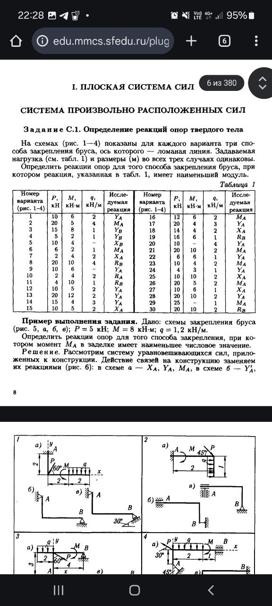

# Заголовок уровня 1

Это обычный текст параграфа с некоторым содержимым.

## Заголовок уровня 2

### Заголовок уровня 3

#### Заголовок уровня 4

##### Заголовок уровня 5

###### Заголовок уровня 6

---

Это текст после горизонтальной линии.

### Маркированный список

- Первый элемент списка
- Второй элемент списка
- Третий элемент списка

### Вложенные списки

- Родительский элемент 1
  - Вложенный элемент 1.1
  - Вложенный элемент 1.2
    - Глубоко вложенный элемент 1.2.1
    - Глубоко вложенный элемент 1.2.2
  - Вложенный элемент 1.3
- Родительский элемент 2
  - Вложенный элемент 2.1
  - Вложенный элемент 2.2

### Нумерованный список

1. Первый пункт
2. Второй пункт
3. Третий пункт

### Вложенный нумерованный список

1. Главный пункт 1
   1. Подпункт 1.1
   2. Подпункт 1.2
      1. Подподпункт 1.2.1
      2. Подподпункт 1.2.2
2. Главный пункт 2
   1. Подпункт 2.1

### Таблица

| Заголовок 1 | Заголовок 2 | Заголовок 3 |
|-------------|-------------|-------------|
| Ячейка 1    | Ячейка 2    | Ячейка 3    |
| Данные A    | Данные B    | Данные C    |

### Цитата

> Это цитата из какого-то источника.
> Может быть многострочной.
> И содержать важную информацию.

### Код-блок

```python
def hello_world():
    print("Hello, World!")
    return True
```

### Ссылки

Вот [ссылка на Google](https://www.google.com) в тексте.

И еще одна [ссылка на GitHub](https://github.com) для примера.

### Изображения




### Текст с inline кодом

В тексте может быть `inline код` для примера.

### Комбинированный контент

Это параграф с [ссылкой](https://example.com) и `кодом`.

---

## Еще один раздел

Текст под новым разделом.

- Элемент списка 1
- Элемент списка 2
  - Вложенный элемент
  - Еще один вложенный

> Цитата в новом разделе

```javascript
console.log("JavaScript код");
```
